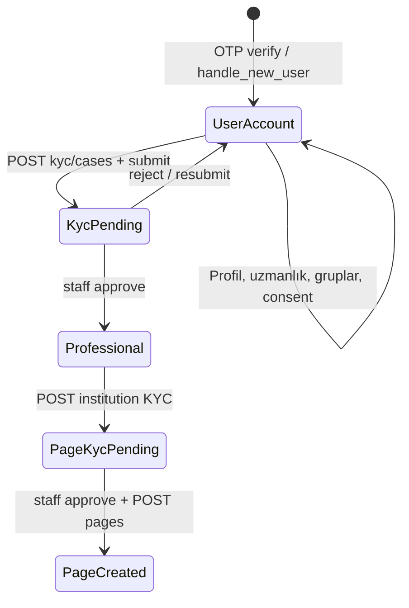

# Account, Profile ve KYC Planı (revize)

## Tasarım kararları (kullanıcı geri bildirimi)

1. **`/v1/onboarding` yok** — onboarding akış sırası web/mobil istemcide yönetilir; API yalnızca atomik kaynak endpoint'leri sunar.
2. **Onboarding zorunlu değil** — API hiçbir endpoint'i "onboarding tamamlanmadan erişilemez" diye kilitlemez (istisna: yetenek bazlı kurallar, örn. pro post = `account_kind=professional`).
3. **KYC onayına kadar `account_kind=user`** — kullanıcı gruplarda gezinir, user profilini düzenler, feed'i deneyimler; professional duvar/takip/evidence postları KYC onayı sonrası açılır.
4. **`account_kind` KYC sonucu belirlenir** — kayıtta veya onboarding intent'te professional seçilmez; staff KYC onayı `profiles.account_kind = professional` + `is_verified = true` yapar.
5. **Professional upgrade istediği zaman** — onboarding'de de olabilir, ayarlardan da; aynı KYC endpoint seti.

---

## Mevcut durum

**Hazır:** Auth, `GET /me`, `GET /me/profiles`, `GET /specialties`, `POST /devices`, `POST /professional-applications`, `POST /pages`, medya upload, `POST /account/delete`.

**Eksik:** Profil/settings/specialties yazma, KYC modeli, `account_kind` upgrade gate, page KYC gate, `GET /me` capabilities.

---

## Yetenek modeli (capabilities)

Sunucu onboarding state tutmaz; istemci **`GET /v1/me/capabilities`** ile yetenekleri okur (`GET /me` yanıtı stabil kalır — mobil OpenAPI sözleşmesi için).



| Yetenek | `user` | KYC pending | `professional` |
|---------|--------|-------------|----------------|
| Grup postu (user) | evet | evet | evet |
| Profil düzenleme | evet | evet | evet |
| Uzmanlık seçimi | evet | evet | evet |
| Kişisel duvar postu | hayır | hayır | evet |
| Takip et/edil | hayır | hayır | evet |
| Evidence zorunlu post | hayır | hayır | evet |
| Page oluşturma | hayır | hayır | evet (institution KYC sonrası) |

**Kural:** `account_kind` yalnızca KYC staff onayında değişir. Pending KYC sırasında kullanıcı tam `user` deneyimine devam eder.

---

## Endpoint kataloğu (tümü — onboarding composable)

### A. Hesap / kimlik (okuma)

| Method | Path | Durum | Açıklama |
|--------|------|-------|----------|
| GET | `/v1/auth/me` | mevcut | GoTrue user (email, confirmed) |
| GET | `/v1/me` | mevcut | user + profiles + settings (capabilities **burada değil**) |
| GET | `/v1/me/profiles` | mevcut | Sahip olunan profiller |
| GET | `/v1/me/capabilities` | **yeni (zorunlu)** | Yetenekler + `professionalUpgrade` — mobil foreground poll |

**`GET /v1/me/capabilities` örneği:**

```json
{
  "capabilities": {
    "accountKind": "user",
    "isVerified": false,
    "canPostToGroups": true,
    "canUsePersonalWall": false,
    "canFollow": false,
    "canCreatePage": false
  },
  "professionalUpgrade": {
    "eligible": true,
    "activeCase": {
      "id": "uuid",
      "status": "under_review",
      "submittedAt": "..."
    }
  }
}
```

### B. Profil

| Method | Path | Açıklama |
|--------|------|----------|
| PATCH | `/v1/me/profile` | `slug?`, `displayName?`, `bio?`, `avatarUrl?` — kişisel user profili (`owner_user_id = auth.uid()`) |
| GET | `/v1/me/slug-available` | `?slug=` → `{ available: boolean, reason?, suggestion? }` |
| GET | `/v1/profiles/{slug}` | mevcut — public read |

**Notlar:**
- Slug değişikliği: DB constraint (`3–40`, `^[a-zA-Z0-9_-]+$`, unique citext) + reserved prefix listesi (`admin`, `api`, …).
- Avatar: `POST /v1/media/upload-init` + `finalize` → `PATCH /me/profile { avatarUrl }`.

### C. Ayarlar

| Method | Path | Açıklama |
|--------|------|----------|
| PATCH | `/v1/me/settings` | `locale?`, `timezone?`, `preferences?` (UI prefs; `contact_email` ayrı auth flow) |
| GET | `/v1/me/settings` | opsiyonel; `/me` zaten settings döndürüyorsa gerekmez |

### D. Uzmanlık ilgisi (feed)

| Method | Path | Açıklama |
|--------|------|----------|
| GET | `/v1/specialties` | mevcut — katalog (public) |
| GET | `/v1/me/specialties` | Kullanıcının seçili uzmanlıkları |
| PUT | `/v1/me/specialties` | `{ specialtyIds: uuid[] }` min 1, max 20, replace; boş dizi → `400`; rate limit ~10/saat |

Onboarding'de veya ayarlarda aynı endpoint; `source` analytics için.

### E. Consent (KVKK — istemci zamanlaması)

| Method | Path | Açıklama |
|--------|------|----------|
| GET | `/v1/consent-versions` | public | Güncel terms/privacy versiyonları (`consent_versions` seed) |
| GET | `/v1/me/consents` | Kayıtlı onaylar |
| POST | `/v1/me/consents` | `{ termsVersion, privacyVersion, marketing? }` — `is_current` doğrulaması |

API consent'i feature gate yapmaz; istemci ilk kullanımda veya yasal gereklilikte modal gösterir.

### F. Cihaz / push

| Method | Path | Açıklama |
|--------|------|----------|
| POST | `/v1/devices` | mevcut — `register-device` proxy |

### G. Professional upgrade (KYC — istediği zaman)

| Method | Path | Açıklama |
|--------|------|----------|
| GET | `/v1/kyc/case-types` | Form şemaları + zorunlu belge tipleri (public veya auth) |
| GET | `/v1/me/kyc/cases` | Kullanıcının tüm case'leri (filtre: `?status=&type=`) |
| POST | `/v1/kyc/cases` | Draft oluştur: `{ caseType: "healthcare_professional", profileId }` |
| GET | `/v1/kyc/cases/{caseId}` | Case detay + documents |
| PATCH | `/v1/kyc/cases/{caseId}` | Payload güncelle (`draft` / `resubmit_required`) |
| POST | `/v1/kyc/cases/{caseId}/documents` | `{ documentType, storagePath, note? }` — `kyc-upload-init` ile alınan path; **media tablosu yok** |
| DELETE | `/v1/kyc/cases/{caseId}/documents/{documentId}` | Belge kaldır (`draft` veya `resubmit_required` + belge `rejected`) |
| POST | `/v1/kyc/cases/{caseId}/submit` | Validasyon + `submitted` → staff bildirimi |
| POST | `/v1/kyc/cases/{caseId}/withdraw` | Draft veya resubmit → iptal (opsiyonel v1) |
| GET | `/v1/me/professional-upgrade` | Shortcut: aktif healthcare_professional case + geçmiş kararlar |

**Staff:**

| Method | Path | Açıklama |
|--------|------|----------|
| GET | `/v1/staff/kyc/cases` | Bekleyen inceleme kuyruğu |
| POST | `/v1/staff/kyc/cases/{caseId}/review` | `{ decision, notes?, documentDecisions? }` — kısmi belge reddi destekli |

**Not alanları (tek model, iki yön):**

| Alan | Kim yazar | Nerede gider | API |
|------|-----------|--------------|-----|
| Case genel not | Staff | `kyc_cases.review_notes` | Review body: `notes` |
| Belge staff notu | Staff | `kyc_documents.staff_note` | Review body: `documentDecisions[].note` |
| Belge kullanıcı notu | Kullanıcı | `kyc_documents.user_note` | Upload body: `note` (max ~500 char) |

Staff review **istek** örneği (`POST /staff/kyc/cases/{id}/review`):

```json
{
  "decision": "resubmit_required",
  "notes": "Genel: Eksik belgeleri tamamlayın.",
  "documentDecisions": [
    { "documentId": "uuid-1", "status": "rejected", "note": "Diploma köşesi kesilmiş." },
    { "documentId": "uuid-2", "status": "accepted" }
  ]
}
```

Kullanıcı belge **istek** örneği (`POST /kyc/cases/{id}/documents`):

```json
{ "documentType": "diploma_or_license", "storagePath": "user-id/case-id/diploma.pdf", "note": "2024 yenileme belgesi" }
```

Case **okuma** yanıtında (`GET /kyc/cases/{id}`) ayni belge birleşik görünür — upload + review sonucu:

```json
{
  "id": "uuid-1",
  "documentType": "diploma_or_license",
  "status": "rejected",
  "userNote": "2024 yenileme belgesi",
  "staffNote": "Diploma köşesi kesilmiş.",
  "uploadedAt": "2026-06-14T..."
}
```

**Karar kuralları:**
- Bir veya daha fazla belge `rejected` → case `resubmit_required` (genel `rejected` yalnızca başvuru tamamen reddedildiğinde)
- Kullanıcı `resubmit_required` iken **yalnızca rejected belge tiplerini** yeniden yükleyebilir; `accepted` belgeler korunur

**Kullanıcı resubmit akışı:**

```mermaid
sequenceDiagram
  participant U as User
  participant API as API
  participant Staff as Staff

  U->>API: POST kyc/cases/id/submit
  Staff->>API: review resubmit_required + documentDecisions
  API-->>U: Bildirim + GET case rejected docs listesi
  U->>API: POST documents diploma_or_license yeni storagePath
  Note over U,API: Eski rejected satır superseded; accepted belgeler dokunulmaz
  U->>API: POST kyc/cases/id/submit
  Staff->>API: review approved
```

**Onay (`healthcare_professional`):**
1. `kyc_cases.status = approved`
2. `profiles.account_kind = professional`, `is_verified = true`
3. `moderation_actions` insert (`action_type: kyc_approved`, target profile)
4. Bildirim: `kyc_decision`

**`POST /v1/professional-applications`:** **kaldırılır (410 Gone)** veya edge read-only; tablo geçmiş için kalır, yeni yazma RLS ile bloklanır. Tek kaynak KYC.

### H. Page oluşturma (institution KYC)

| Method | Path | Açıklama |
|--------|------|----------|
| POST | `/v1/kyc/cases` | `{ caseType: "healthcare_institution", payload: { intendedSlug?, ... } }` |
| POST | `/v1/kyc/cases/{caseId}/submit` | Kurum belgeleri |
| POST | `/v1/staff/kyc/cases/{caseId}/review` | Onay |
| POST | `/v1/pages` | `{ slug, displayName, ownerProfileId, kycCaseId }` — **yalnızca** onaylı institution case + owner `account_kind=professional` |

`create-page` edge: `kycCaseId` zorunlu, case `approved` + `target_entity_type=page` veya submit sırasında `intendedSlug` eşleşmesi.

### I. Hesap silme

| Method | Path | Durum |
|--------|------|-------|
| POST | `/v1/account/delete` | mevcut — PR-8'de sertleştirme |

### J. Yasal — veri indirme ve hesap kapatma (PR-8)

| Method | Path | Açıklama |
|--------|------|----------|
| POST | `/v1/account/export` | Async veri paketi talebi (KVKK md. 11 / GDPR Art. 20) |
| GET | `/v1/account/export/{exportId}` | `queued` \| `ready` \| `expired` \| `failed` |
| GET | `/v1/account/export/{exportId}/download` | Signed URL (7 gün TTL) |
| POST | `/v1/account/delete` | Re-auth: TOTP enrolled → AAL2 challenge; değilse son 5 dk OTP |

Export job: **`account_exports`** tablosu + `content_pipeline_runs` worker referansı.

### K. 2FA authenticator (Auth Faz 2 — paralel, bu sprint zorunlu değil)

| Method | Path | Açıklama |
|--------|------|----------|
| GET | `/v1/auth/mfa/factors` | Kayıtlı TOTP faktörleri |
| POST | `/v1/auth/mfa/totp/enroll` | QR / secret |
| POST | `/v1/auth/mfa/totp/verify` | Enroll tamamlama |
| POST | `/v1/auth/mfa/challenge` | Hassas işlem için AAL2 |
| POST | `/v1/auth/mfa/totp/unenroll` | Kaldır (re-auth gerekli) |

Önkoşul: Supabase Dashboard MFA TOTP açık ([`config.toml`](supabase/config.toml) şu an `enroll_enabled = false`). OTP zaten bir faktör; TOTP ikinci faktör. Login MFA challenge istemci değişikliği büyük → beta sonrası.

---

## Yasal uyumluluk özeti

| Konu | Bu aşamada? | Nerede? |
|------|-------------|---------|
| Consent audit | Evet | PR-3 `POST /me/consents` |
| Hesap kapatma | Kısmen var | PR-8: re-auth + hard-delete worker |
| Verilerimi indir | Hayır → PR-8 | Launch öncesi şart |
| 2FA TOTP | Hayır → Auth Faz 2 | Beta sonrası makul; delete/KYC step-up PR-8'de OTP ile başlanır |

---

## Veri modeli (Faz 1 migration)

### Kaldırılan (önceki plandan)

- ~~`onboarding_progress`~~ — sunucu onboarding state yok
- ~~`POST /onboarding/intent`~~
- ~~`POST /onboarding/complete`~~
- ~~`GET /onboarding`~~

### Eklenen / korunan

| Tablo | Amaç |
|-------|------|
| `consent_versions` | Seed: güncel terms/privacy versiyonları (`is_current`) |
| `user_consents` | Audit trail |
| `kyc_case_types` | `code`, `version`, `schema jsonb`, `is_current`, `required_document_types[]` |
| `kyc_cases` | `user_id`, `profile_id`, `case_type`, `case_type_version`, `target_entity_type` (`profile`\|`page`), `status`, `payload jsonb`, review alanları |
| `kyc_documents` | `case_id`, `document_type`, `storage_path`, `status`, `user_note`, `staff_note`, `superseded_by uuid` (null = güncel) |

**PR-1 index / constraint:**
- Partial unique: `(user_id, case_type) WHERE status NOT IN ('approved','rejected','withdrawn')`
- Submit: payload, case'in kilitli `case_type_version` şemasına göre validate; güncel değilse `409 outdated_case_type`
- Storage: `kyc-documents` bucket + `can_read_storage_object` genişlemesi (owner + platform_staff)
- Upload: **`POST /v1/kyc/upload-init`** (veya dedicated edge) — `media` tablosuna **yazılmaz**

**Bağlantılar:**
- `pages.kyc_case_id` FK
- `professional_applications`: read-only geçmiş; yeni akış KYC-only

**Case type seed (v1):**
- `healthcare_professional` — bireysel sağlık profesyoneli upgrade
- `healthcare_institution` — page/kurum

**Professional payload (özet):** `legalFullName`, `professionType`, `licenseNumber`, `licenseIssuingAuthority`, `primarySpecialtyId?`, `institutionName?`, `attestationAccepted`

**Institution payload (özet):** `legalEntityName`, `taxId`, `registryNumber`, `representativeName`, `institutionType`

**Storage:** private bucket `kyc-documents` + dedicated upload init (advices §1–2).

---

## Architecture review — [`advices-account-profile-kyc.md`](advices-account-profile-kyc.md)

Kaynak inceleme özeti; plana alınan kararlar:

| # | Konu | Karar |
|---|------|--------|
| 1 | KYC belgeleri `media` tablosunda | **Kabul** — ayrı `kyc_documents.storage_path`; pipeline/RLS karmaşası yok |
| 2 | `kyc-documents` bucket RLS yok | **Kabul** — PR-1 storage policy (owner + staff) |
| 3 | Resubmit'te güncel belge | **Kabul** — `superseded_by`; sorgu: `WHERE superseded_by IS NULL` |
| 4 | Case type schema versioning | **Kabul** — `is_current` + submit'te `409 outdated_case_type` |
| 5 | Staff onay audit | **Kabul** — `moderation_actions` insert |
| 6 | `professional_applications` alias | **Kabul (read-only)** — alias yok; tablo geçmiş; RLS write block |
| 7 | Aktif case uniqueness | **Kabul** — partial unique index |
| 8 | Payload DB check constraint | **Kısmen** — submit edge'de strict validate; DB check yalnızca `attestationAccepted=true` (opsiyonel v1.1) |
| 9 | PUT specialties boş dizi | **Kabul** — min 1 + rate limit |
| 10 | `/me/capabilities` opsiyonel | **Kabul** — ayrı zorunlu endpoint |
| 11 | Export job persistence | **Kabul** — `account_exports` tablosu PR-8 |
| 12 | Page–KYC case type karışması | **Kabul** — `target_entity_type` + create-page doğrulama |
| 13 | Consent version catalog | **Kabul** — `consent_versions` + `GET /consent-versions` |
| 14 | Delete MFA step-up dalı | **Kabul** — PR-8'de TOTP/OTP branch (Auth Faz 2'ye hazır) |

**PR-1 öncesi bloklayıcılar (🔴):** #1, #2, #3, #12 — KYC endpoint'leri bunlar olmadan canlıya çıkmaz.

---

## İstemci onboarding örnekleri (API'den bağımsız)

API bunları zorunlu kılmaz; istemci istediği sırayı uygular.

**Web — ilk giriş (soft onboarding):**
1. `GET /me` → boş profil mi kontrol
2. `GET /consent-versions` → modal: `POST /me/consents`
3. İsteğe bağlı: `PATCH /me/profile`, `PUT /me/specialties`
4. Feed'e geç

**Mobil — professional upgrade (ayarlar veya onboarding kartı):**
1. `GET /me/capabilities` → `professionalUpgrade.eligible`
2. `GET /kyc/case-types/healthcare_professional` → form render
3. `POST /kyc/cases` → belgeler → `submit`
4. KYC pending iken normal user deneyimi devam
5. Push/bildirim: onay → `GET /me/capabilities` → `accountKind=professional`

**Page oluşturma:**
1. `GET /me/capabilities` → `canCreatePage` false ise institution KYC wizard
2. KYC approve → `POST /pages` with `kycCaseId`

---

## Implementasyon pattern

| Katman | Endpoint grubu | Yaklaşım |
|--------|----------------|----------|
| Worker + user JWT | `/me/profile`, `/me/settings`, `/me/specialties`, `/me/consents`, `/kyc/cases` GET | PostgREST RLS ([`me.ts`](apps/api/src/routes/v1/me.ts) pattern) |
| Edge proxy | KYC submit, staff review, attach document (validasyon) | [`edge-map.ts`](packages/shared/src/edge-map.ts) |
| Edge refactor | `create-page`, `submit-professional-application` | KYC gate |

Yeni route dosyaları:
- [`apps/api/src/routes/v1/profile.ts`](apps/api/src/routes/v1/profile.ts) — profile, settings, specialties, consents
- [`apps/api/src/routes/v1/kyc.ts`](apps/api/src/routes/v1/kyc.ts) — KYC read + proxy writes

Schemas: [`packages/shared/src/schemas/profile.ts`](packages/shared/src/schemas/profile.ts), [`kyc.ts`](packages/shared/src/schemas/kyc.ts)

---

## PR sırası

| PR | İçerik |
|----|--------|
| **PR-1** | Migration: consents + kyc_* + FK'lar + bucket + seed case types |
| **PR-2** | PATCH profile/settings, PUT/GET specialties, slug-available |
| **PR-3** | Consents GET/POST + `GET /me` capabilities genişletmesi + `GET /kyc/case-types` |
| **PR-4** | KYC edge (create/update/submit/documents/review) + proxy routes |
| **PR-5** | Professional upgrade birleştirme; `GET /me/professional-upgrade`; deprecate legacy application POST |
| **PR-6** | Page KYC gate + `create-page` refactor |
| **PR-7** | Tests + `docs/api/account.md` + `docs/api/kyc.md` + OpenAPI |
| **PR-8** | GDPR/KVKK: data export, delete re-auth, hard-delete pipeline, `docs/api/privacy.md` |
| **Auth Faz 2** (paralel) | TOTP MFA GoTrue proxy + hassas işlem step-up |

---

## v1 dışı (güncellendi)

- Sunucu tarafı onboarding zorunluluğu / step engine
- Otomatik KYC (OCR, registry API, liveness)
- `GET /v1/feed/home`
- `user_specialties` + `user_specialty_weights` birleştirme (feed planı)
- Login MFA challenge (Auth Faz 2'ye bırakıldı; PR-8 delete step-up MFA'yı opsiyonel destekler)
