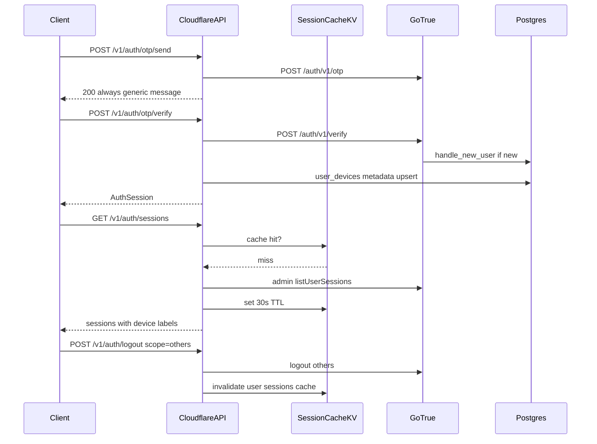

# API Auth Geliştirme Planı

Kaynak öneriler: [`advices.md`](advices.md) §8 (auth plan critique) + ilgili §3.2, §4.3, §6.3.

## Kararlar

| Konu | Karar |
|------|--------|
| Auth backend | Supabase GoTrue (proxy) |
| Giriş / kayıt | **Passwordless — e-posta OTP (6 hane)**; şifre yok |
| OTP kanalı | Sadece e-posta |
| OTP send yanıtı | **Her zaman 200** — e-posta kayıtlı mı sızdırma (advices §8.2) |
| OAuth | Google + Apple |
| Çoklu cihaz | İzin var; kaynak: **GoTrue `auth.sessions`** (tek source of truth) |
| Session metadata | **`user_devices` genişletme** — `user_auth_sessions` tablosu **yok** (advices §8.1) |
| Session list cache | Cloudflare **KV, 30s TTL** — admin API rate limit (advices §8.3) |
| OAuth PKCE | **Signed HttpOnly cookie** 10 dk — Workers stateless (advices §8.4) |
| Rate limit | GoTrue per-email OTP limit + API **yalnızca IP** (advices §8.10) |
| Refresh güvenliği | GoTrue **refresh token rotation** açık (advices §8.9) |
| Max sessions | Limit aşımında **LRU (`last_used_at`)** — en eski değil (advices §8.5) |
| `last_seen_at` | **Yok** — GoTrue native; middleware sync write yok (advices §8.7) |
| Email change | **GoTrue built-in** magic link (Faz D); custom OTP ertelenir (advices §8.8) |
| Hesap silme | Mevcut `delete-account` edge + `logout scope=global` (advices §3.2) |

## Mevcut durum (değişecek)

Bugün: [`apps/api/src/routes/v1/auth.ts`](apps/api/src/routes/v1/auth.ts) — şifreli login/signup.

Hedef: `otp/send` + `otp/verify`; password route'ları kaldırılır.

DB: [`handle_new_user`](supabase/migrations/20260615000002_core_identity.sql) — OTP verify ile kullanıcı + profil + `user_settings`.

[`user_settings.preferences.contact_email`](supabase/migrations/20260620000001_advices_closure.sql) — iletişim e-postası signup'ta (advices §4.3, auth ile uyumlu).



---

## Passwordless OTP (Faz A — PR-1)

### Endpoint'ler

| Method | Path | GoTrue | Not |
|--------|------|--------|-----|
| POST | `/v1/auth/otp/send` | `POST /otp` | **Her zaman 200** |
| POST | `/v1/auth/otp/verify` | `POST /verify` | → `AuthSession` |
| POST | `/v1/auth/refresh` | refresh grant | rotation açık |
| POST | `/v1/auth/logout` | `POST /logout` | `scope`: local \| others \| global |
| GET | `/v1/auth/me` | `GET /user` | |

**Kaldırılacak:** `/auth/login`, `/auth/signup`, forgot/reset/change password, **`POST /auth/sessions/revoke-others`** (advices §8.6 — `logout?scope=others` yeterli).

### OTP send — enumeration-safe (advices §8.2)

```json
// Request
{ "email": "user@example.com", "intent": "signup" | "login" | "auto" }

// Response — her zaman 200
{ "ok": true, "message": "If this email is eligible, a code was sent." }
```

- `createUser` client'a sızdırılmaz; GoTrue'a `should_create_user` intent'e göre lib içinde
- `user_not_found` **yalnızca verify** aşamasında (OTP e-posta sahipliğini kanıtladıktan sonra)
- GoTrue 429 → API `rate_limited` olarak pass-through (advices §8.10)

### OTP verify

```json
{
  "email": "user@example.com",
  "code": "123456",
  "deviceName": "iPhone 15",
  "platform": "ios"
}
```

Verify sonrası: `user_devices` veya yeni kolonlarla session metadata (aşağı).

### Rate limiting (advices §8.10)

| Katman | Kapsam |
|--------|--------|
| GoTrue | Per-email OTP (Dashboard config) |
| API [`rate-limit.ts`](apps/api/src/middleware/rate-limit.ts) | **IP only** on `/auth/otp/*` — bulk enumeration koruması |
| Per-email limit API'de **tekrarlanmaz** |

---

## Çoklu cihaz oturum yönetimi (Faz B — PR-2)

### Tek source of truth (advices §8.1)

- **Listele / revoke:** GoTrue Admin API (`listUserSessions`, `deleteUserSession`)
- **`user_auth_sessions` tablosu plan dışı** — dual truth riski
- **Cihaz etiketi:** mevcut [`user_devices`](docs/supabase/tables/user_devices.md) genişletmesi:

```sql
-- Migration: user_devices session metadata
alter table public.user_devices
  add column if not exists gotrue_session_id uuid,
  add column if not exists device_name text,
  add column if not exists user_agent text;
-- push_token nullable yapılabilir (session-only kayıt için)
```

OTP/OAuth verify sonrası upsert; session revoke → ilgili `user_devices` satırını disable et veya sil.

### Endpoint'ler

| Method | Path | Açıklama |
|--------|------|----------|
| GET | `/v1/auth/sessions` | GoTrue sessions + `user_devices` device_name join |
| DELETE | `/v1/auth/sessions/{sessionId}` | Admin deleteSession + KV invalidate |
| POST | `/v1/auth/logout` | `scope`: local (default), **others**, global |

~~`POST /auth/sessions/revoke-others`~~ — kaldırıldı (advices §8.6).

### Session list cache (advices §8.3)

- Wrangler **KV** binding `SESSION_CACHE` (veya mevcut CONFIG KV)
- Key: `sessions:{userId}` — TTL **30 saniye**
- Invalidate: DELETE session, logout (others/global)
- Write (revoke) her zaman doğrudan GoTrue admin — cache bypass

[`gotrue-admin.ts`](apps/api/src/lib/gotrue-admin.ts): `listUserSessionsCached(userId)`.

### Max sessions (Faz E — advices §8.5)

- Limit örn. 10 aktif session
- Yeni verify öncesi: admin list → **`last_used_at ASC`** sırala → fazlalığı revoke (LRU, not oldest created)
- Yeni cihaz bildirimi: `emit-notification` (advices §8.5 / plan Faz E)

---

## OAuth Google + Apple (Faz C — PR-3)

| Method | Path |
|--------|------|
| GET | `/v1/auth/oauth/{provider}` |
| GET | `/v1/auth/callback` |

**PKCE storage (advices §8.4):** authorize redirect öncesi signed **HttpOnly cookie** (`pkce_verifier`, `state`, 10 dk). Callback'te oku + temizle. In-memory/KV gereksiz.

[`lib/oauth.ts`](apps/api/src/lib/oauth.ts) — allowlist redirect URI.

---

## Web oturum & hesap (Faz D — PR-4)

- Refresh token **HttpOnly cookie** (web)
- Logout cookie clear
- **Email change:** GoTrue built-in flow (magic link to new email) — custom OTP **ertelendi** (advices §8.8)
- ~~Middleware `last_seen_at`~~ — yapılmayacak (advices §8.7)

---

## GDPR & hesap silme (advices §3.2)

Mevcut [`delete-account`](supabase/functions/delete-account/index.ts) edge proxy korunur. Auth planı entegrasyonu:

1. `POST /v1/account/delete` (authenticated)
2. Önce `logout scope=global` (tüm session'lar)
3. Edge: profil soft-delete + `content_pipeline_runs` enqueue (30 gün retention — advices §3.2)
4. [`docs/api/auth.md`](docs/api/auth.md) akış diyagramı

---

## Sertleştirme (Faz E — PR-5)

| Öneri | Uygulama |
|-------|----------|
| advices §8.9 | Dashboard: refresh token rotation enabled |
| advices §8.10 | IP-only API rate limit on auth |
| advices §6.3 | Staff auth işlemleri → `admin_audit_log` (mevcut migration) |
| advices §2.5 | [`mapDbError`](packages/shared/src/errors.ts) — API read route'larında kullan |
| Mevcut API | [`IdempotencyStore`](apps/api/src/durable-objects/idempotency-store.ts) DO — write proxy ile (advices §2.1) |
| api-client | `sendOtp`, `verifyOtp`, `listSessions`, `revokeSession`, `logout(scope)` |

---

## advices.md — auth dışı (API roadmap referansı)

Bu plan kapsamında **değil**, Faz 2+ API backlog'a referans:

| advices | Konu | API fazı |
|---------|------|----------|
| §3.1 | Feed visibility explicit filters | Feed mixer (cloudflare plan Faz D) |
| §5.3 | `get_feed_posts` RPC | Okuma route'ları (mevcut) |
| §2.2 | Split group membership functions | Edge refactor |
| §1.7 | `system_settings` whitelist | Supabase done — API staff-only reads |

---

## Dosya yapısı

```
apps/api/src/
  lib/gotrue.ts
  lib/gotrue-admin.ts      # + KV session cache
  lib/auth-errors.ts
  lib/oauth.ts             # PKCE cookie
  routes/v1/auth.ts
  middleware/rate-limit.ts # IP-only auth limits

packages/shared/src/schemas/auth.ts

supabase/migrations/
  *_user_devices_session_metadata.sql   # PR-2, not user_auth_sessions

docs/api/
  auth.md
  auth-setup.md            # SMTP, OTP, rotation, GoTrue rate limits
```

---

## PR sırası

1. **PR-1:** OTP send/verify (enumeration-safe), gotrue lib, `/auth/me`, logout scopes, eski password routes kaldır
2. **PR-2:** Sessions list/revoke + KV cache, `user_devices` migration, auth-setup docs, delete-account auth flow
3. **PR-3:** OAuth + PKCE cookie
4. **PR-4:** Web refresh cookie, GoTrue email change
5. **PR-5:** api-client, LRU max sessions, new-device notify, admin audit, IP rate limit

---

## Başarı kriterleri

1. OTP send unknown email → **200** (verify fails appropriately)
2. İki cihaz verify → iki session; GET sessions (cached ≤30s) doğru listeler
3. DELETE session → GoTrue + KV invalidate; refresh o cihazda ölür
4. `logout scope=others` — revoke-others endpoint olmadan çalışır
5. OAuth callback PKCE cookie ile cross-isolate güvenilir
6. Max session eviction LRU not FIFO-by-created
7. `user_auth_sessions` tablosu oluşturulmaz
8. delete-account + global logout dokümante

---

## Kapsam dışı

- `user_auth_sessions` tablosu
- `POST /auth/sessions/revoke-others`
- Middleware sync `last_seen_at`
- Custom OTP email change (Faz D+)
- SMS OTP, şifre, MFA
- Per-email API rate limit (GoTrue'a bırakılır)
