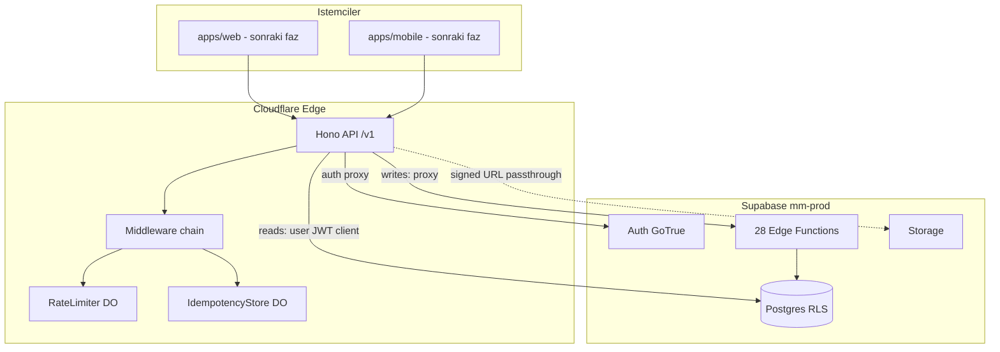

# Cloudflare Workers API Katmanı — Uygulama Planı

## Başlangıç durumu

- Supabase Faz 1 **tamam**: 21 migration, 28 edge function, `get_feed_posts()` RPC v1, [`report.md`](report.md) API-ready.
- Repo **henüz monorepo değil** (kök `package.json` yok); [`supabase/functions/_shared/config.ts`](supabase/functions/_shared/config.ts) sabitleri `packages/shared`'a taşınacak.
- Mevcut referans plan: [`.cursor/plans/supabase_cloudflare_api_temeli_53d0ba84.plan.md`](.cursor/plans/supabase_cloudflare_api_temeli_53d0ba84.plan.md) — bu plan güncel Supabase durumuna ve seçilen kararlara göre revize edilmiştir.

## Seçilen kararlar

| Konu | Karar |
|------|--------|
| Auth | **Tam API proxy** — istemci yalnızca Cloudflare API URL bilir; login/signup/refresh/logout Worker üzerinden Supabase GoTrue'ya proxy |
| İlk dilim | **İskelet + edge proxy + OpenAPI + okuma** (health, me, grup kronolojik); 5-pool mixer **Faz C** |
| Tek Worker | v1'de tek `apps/api` Worker; feed mixer aynı Worker içinde route grubu (ayrı deploy yok) |
| OpenAPI | `@hono/zod-openapi` — tek doğruluk kaynağı `packages/shared` zod şemaları |

---

## Hedef mimari



### Sorumluluk ayrımı

| İş | Katman | Neden |
|----|--------|-------|
| Login / signup / refresh / logout | **API → GoTrue REST** | Tam proxy kararı; istemci Supabase URL bilmez |
| Post oluşturma, mesaj, moderasyon vb. | **API → Edge Function proxy** | 28 function'daki iş kuralları tekrar yazılmaz |
| Profil okuma, grup feed kronolojik | **API → PostgREST** (user-scoped client) | RLS korunur; basit SELECT |
| Home feed mixer (5-pool) | **API Worker logic** + RPC | [`feed_ranking_v2`](.cursor/plans/feed_ranking_v2_6abd97cd.plan.md) Faz C |
| Realtime bildirimler | **Faz 3**: API WebSocket bridge veya dokümante edilmiş istisna | v1'de push/in-app yeterli |

---

## Monorepo yapısı

```
mediamedicine/
  package.json, pnpm-workspace.yaml, turbo.json, tsconfig.base.json, .nvmrc (22)
  apps/
    api/                    # Cloudflare Worker — Hono
      src/
        index.ts
        env.ts
        middleware/
        routes/v1/
        lib/                  # supabase clients, edge proxy, logger
        durable-objects/
      wrangler.jsonc
      vitest.config.ts
  packages/
    shared/                   # zod şemalar, hata kodları, feed/config sabitleri
    api-client/               # fetch SDK (web tüketir)
    config/                   # eslint, tsconfig preset
  openapi/
    openapi.json              # build artefact (Dart client kaynağı — Faz 4)
  supabase/                   # mevcut — dokunulmaz
  docs/
    api/                      # yeni — route sözleşmeleri
```

`pnpm-workspace.yaml`: `apps/api`, `packages/*` — Flutter `apps/mobile` JS workspace dışında kalır (mevcut plan ile uyumlu).

---

## `apps/api` — çekirdek tasarım

### Wrangler bindings ([`wrangler.jsonc`](apps/api/wrangler.jsonc))

- **Secrets**: `SUPABASE_URL`, `SUPABASE_ANON_KEY`, `SUPABASE_SERVICE_ROLE_KEY`, `SUPABASE_JWT_SECRET`
- **Durable Objects**: `RATE_LIMITER`, `IDEMPOTENCY` (`new_sqlite_classes` migration)
- **KV** (opsiyonel v1): `CONFIG` — feature flags / mixer profilleri (Faz E)
- **Analytics Engine**: istek metrikleri (`route`, `status`, `latency_ms`, `version`)
- **Ortamlar**: `staging`, `production` — ayrı Supabase branch veya aynı proje + prefix (staging önerilir)

### Middleware zinciri (sıra önemli)

1. `requestId` — `X-Request-Id` üret / ilet
2. `cors` — production'da allowlist origin
3. `errorHandler` — `{ error: { code, message, requestId } }` ([edge `_shared/response.ts`](supabase/functions/_shared/response.ts) ile uyumlu kodlar)
4. `auth` — JWT doğrulama (`jose` + `SUPABASE_JWT_SECRET`); public route'lar hariç
5. `rateLimit` — `RateLimiter` DO (IP + userId + route)
6. `idempotency` — `Idempotency-Key` header'lı POST/PATCH/PUT → `IdempotencyStore` DO
7. `telemetry` — Analytics Engine write

### Supabase entegrasyonu ([`apps/api/src/lib/supabase.ts`](apps/api/src/lib/supabase.ts))

```typescript
// Üç client modu:
createAnonClient()           // auth proxy (signup/login — anon key)
createUserClient(jwt)        // PostgREST reads — RLS uygulanır
createServiceClient()        // staff/cron — RLS bypass, dikkatli kullanım
```

**Auth proxy** (`/v1/auth/*`): Supabase GoTrue REST'e forward — `POST /token?grant_type=password`, `signup`, `refresh`, `logout`. Yanıt gövdesi normalize edilir; refresh token HTTP-only cookie **opsiyonel** (web Faz 3'te `@supabase/ssr` yerine API cookie stratejisi).

**Edge proxy** ([`apps/api/src/lib/edge-proxy.ts`](apps/api/src/lib/edge-proxy.ts)):

```
POST /v1/posts              → functions/v1/create-post
POST /v1/posts/:id/comments → functions/v1/create-comment
POST /v1/social/follow      → functions/v1/toggle-follow
... (28 function eşlemesi — docs/api/edge-map.md)
```

Proxy kuralları:
- Kullanıcı JWT'sini `Authorization: Bearer` olarak ilet (edge `verify_jwt=true` function'lar)
- `Idempotency-Key` ve `X-Request-Id` header'larını forward et
- Yanıt gövdesini olduğu gibi döndür (edge error formatı zaten standart)
- Internal function'lar (`emit-notification`, `communication-dispatch`) **API'den expose edilmez**

---

## OpenAPI stratejisi

- Route tanımları: **`@hono/zod-openapi`** + [`packages/shared`](packages/shared) zod şemaları
- Canlı spec: `GET /v1/openapi.json`
- Build: `pnpm --filter api openapi:export` → [`openapi/openapi.json`](openapi/openapi.json)
- Hata modeli: `ApiError { code, message, requestId? }` — edge ile aynı `snake_case` kodlar
- İlk dilimde dokümante edilecek route'lar:
  - `GET /v1/health`
  - `POST /v1/auth/signup`, `/login`, `/refresh`, `/logout`
  - `GET /v1/me`, `GET /v1/me/profiles`
  - `GET /v1/feed/groups/{slug}` (kronolojik)
  - Edge proxy route'ları **tag: internal-write** ile gruplanır; OpenAPI'de tam listelenir

Mobil (Faz 4): `openapi.json` → Dart client codegen script'i (`mobile:gen`).

---

## Route haritası — fazlara göre

### Faz A — Monorepo + Worker iskelet (1. dilim)

- Monorepo scaffold (pnpm + turbo + tsconfig)
- [`packages/shared`](packages/shared): `ApiError`, hata kodları, `POST_BODY_MAX_CHARS`, `STORAGE_BUCKETS` — [`supabase/functions/_shared/config.ts`](supabase/functions/_shared/config.ts) ile senkron
- Hono app + `/v1` router + `GET /v1/health` (Supabase ping: `health` edge veya PostgREST `profiles?limit=1`)
- Wrangler local dev + vitest-pool-workers smoke test
- `docs/api/README.md` + mimari diyagram güncellemesi

### Faz B — Auth proxy + Edge proxy + OpenAPI (1. dilim devam)

- `/v1/auth/*` GoTrue proxy (tam proxy kararı)
- Generic edge proxy router: `POST /v1/_edge/{functionName}` **veya** domain route'lar (tercih: **domain route'lar** — daha iyi DX)
- Domain route eşlemesi (örnek):

| REST | Edge Function |
|------|---------------|
| `POST /v1/posts` | create-post |
| `POST /v1/media/upload-init` | media-upload-init |
| `POST /v1/messages` | send-message |
| `POST /v1/account/delete` | delete-account |
| ... | (tam tablo `docs/api/routes.md`) |

- OpenAPI export + `packages/api-client` minimal SDK (`health`, `login`, `createPost`)
- Durable Objects: `RateLimiter`, `IdempotencyStore` + middleware bağlama

### Faz C — Okuma route'ları (1. dilim kapanış)

- `GET /v1/me` — auth user + `profiles` + `user_settings`
- `GET /v1/feed/groups/{slug}` — keyset pagination (`posts.published_at`, `group_id`), visibility filtreleri **PostgREST query ile** (`can_view_post` RPC maliyetinden kaçınmak için grup feed'de explicit `group_id` + `status=published`)
- `GET /v1/profiles/{slug}` — profil + post_count (duvar yoksa 404 veya redirect)
- `GET /v1/specialties` — katalog listesi (feed onboarding için)

### Faz D — Feed home mixer (sonraki dilim — bilinçli erteleme)

[`feed_ranking_v2`](.cursor/plans/feed_ranking_v2_6abd97cd.plan.md) ile uyumlu:

- `packages/shared/src/config/feed.ts` — 5 pool oranları, FinalScore ağırlıkları
- `FeedSessionDO` — seen dedup, session-scoped cursor
- `GET /v1/feed/home` — pool mixer + `feed_score` + specialty ağırlıkları
- `POST /v1/feed/impressions` → edge `record-feed-impressions` proxy (zaten Faz B'de)

### Faz E — Sertleştirme (beta öncesi)

- KV specialty pool cache cron
- Analytics Engine dashboard / Logpush
- Staging CI: `turbo test` + `wrangler deploy --env staging`
- Security review: service role yalnızca auth proxy + staff route'larda

---

## Güvenlik prensipleri

- **Service role** yalnızca: auth admin işlemleri, staff route'ları, edge proxy (server-side)
- **Asla** service role istemciye sızmaz; Worker secrets only
- JWT doğrulama her protected route'ta; edge'e user JWT forward (RLS edge içinde de geçerli)
- Staff route'ları: `/v1/staff/*` — ek `platform_staff` kontrolü (PostgREST veya edge proxy)
- Rate limit: auth endpoint'lerde agresif (brute force), write route'larda user bazlı

---

## `packages/shared` — edge ile senkron

| Kaynak (edge) | Hedef (shared) |
|---------------|----------------|
| `_shared/config.ts` | `packages/shared/src/config/platform.ts` |
| `_shared/feed.ts` | `packages/shared/src/config/feed.ts` |
| `_shared/db-error.ts` kodları | `packages/shared/src/errors.ts` |

İleride: tek kaynak shared, edge Deno import map ile `@mediamedicine/shared` tüketir (Faz E refactor — v1'de manuel senkron + yorum).

---

## Lokal geliştirme akışı

```bash
supabase start                    # Postgres + GoTrue local
pnpm install
pnpm --filter api dev             # wrangler dev + .dev.vars
# .dev.vars: SUPABASE_URL=http://127.0.0.1:54321, keys from supabase status
turbo run dev                     # ileride web eklenince
```

Test: `@cloudflare/vitest-pool-workers` — auth middleware, rate limit, edge proxy mock.

---

## Dokümantasyon teslimleri

- [`docs/api/README.md`](docs/api/README.md) — genel bakış, auth akışı, hata kodları
- [`docs/api/routes.md`](docs/api/routes.md) — REST ↔ edge eşleme tablosu
- [`docs/api/auth.md`](docs/api/auth.md) — tam proxy auth sequence diagram
- [`docs/README.md`](docs/README.md) — Faz 2 bölümü güncelle
- [`CLAUDE.md`](CLAUDE.md) — monorepo komutları

---

## Kapsam dışı (bu plan)

- `apps/web` Next.js iskeleti (Faz 3)
- `apps/mobile` Flutter (Faz 4)
- 5-pool mixer + FeedSession DO (Faz D — bilinçli erteleme)
- CI/CD pipeline (ayrı task)
- Realtime WebSocket bridge

---

## Başarı kriterleri (Faz A–C tamamlandığında)

1. `GET /v1/health` + `GET /v1/openapi.json` çalışır
2. Signup/login/refresh tamamen API üzerinden; istemci Supabase URL bilmeden oturum açabilir
3. En az 5 edge proxy route (create-post, create-comment, send-message, toggle-follow, register-device) uçtan uca çalışır
4. `GET /v1/me` ve `GET /v1/feed/groups/{slug}` PostgREST ile RLS korumalı döner
5. Idempotency + rate limit middleware testleri geçer
6. `packages/api-client` ile login + createPost örneği çalışır
