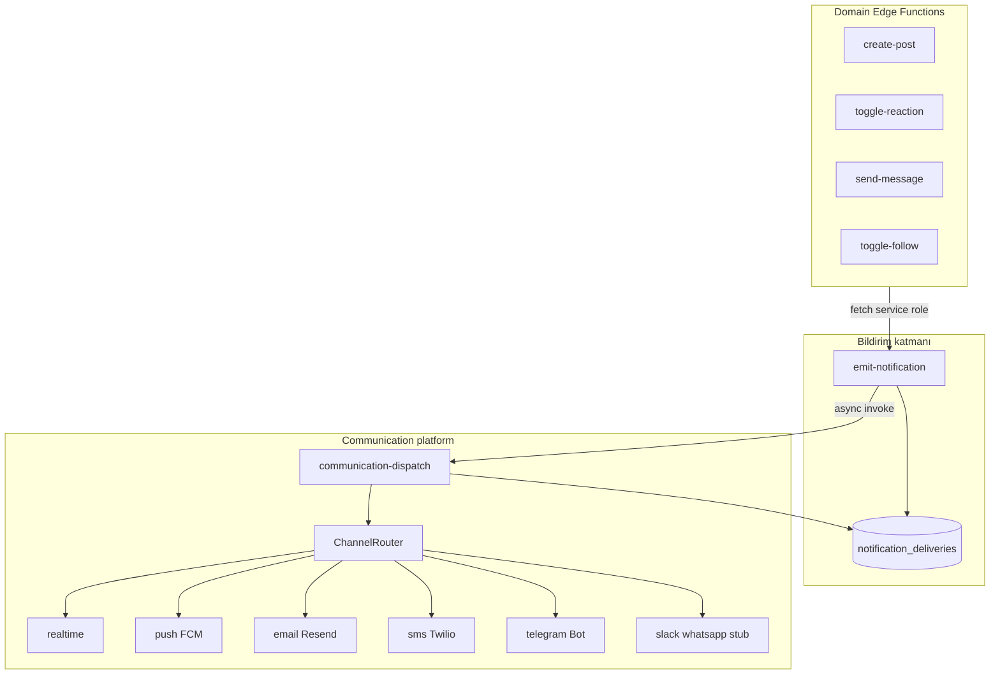
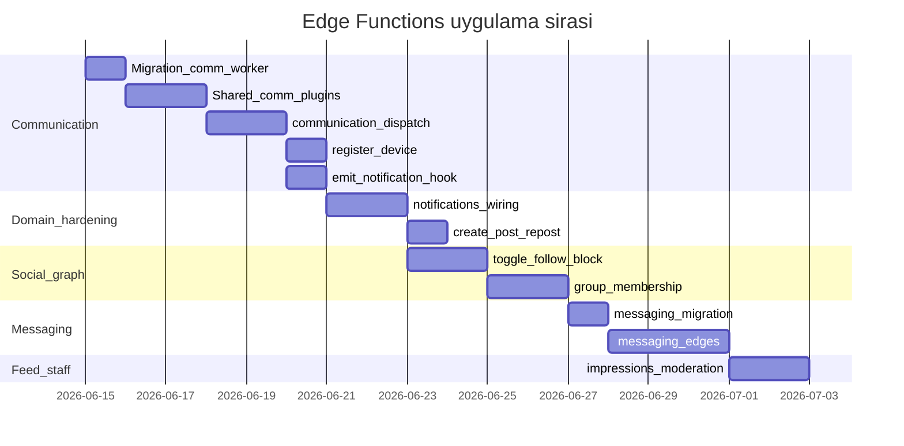

# Edge Functions Tamamlama Planı

## Mevcut durum

**Deploy edilmiş (9 function):** [`supabase/functions/`](supabase/functions/)

| Function | Durum | Eksik |
|----------|-------|-------|
| `media-upload-init` / `media-finalize` | Çalışır | `message-media` bucket, video→pipeline tetikleme |
| `create-post` | Çalışır | quote/repost doğrulama, `emit-notification` side-effect yok |
| `link-preview` | Çalışır | Rate limit / SSRF sıkılaştırma (opsiyonel) |
| `create-comment` / `toggle-reaction` | Çalışır | Bildirim tetikleme yok |
| `submit-report` | Çalışır | Staff bildirimi yok |
| `emit-notification` | Çalışır | `communication-dispatch` tetikleme yok |
| `content-pipeline-collect` | İskelet | Gerçek pipeline yok (bilinçli) |

**Schema hazır, edge yok:** `follows`, `blocks`, `group_members`, `user_devices`, `feed_impressions`, `professional_applications`, `moderation_actions`

**Schema yok (Faz 2):** `conversations`, `conversation_participants`, `messages`, `message-media` bucket — [social graph plan §7](.cursor/plans/social_graph_platform_dd42bd33.plan.md)

**Henüz planlanmamış:** Communication platform, messaging edges, feed impressions, social graph action edges, staff moderation edges

---

## Mimari: üç katman



**Sözleşme kuralı:** Domain function'lar asla doğrudan FCM/SMTP çağırmaz; her zaman [`emit-notification`](supabase/functions/emit-notification/index.ts) üzerinden gider. Communication yalnızca `notification_deliveries.status = pending` satırlarını işler.

**API Worker (sonra):** Rate limit, idempotency, batch orchestration — edge'leri çağırır; edge mantığı değişmez.

---

## Paylaşılan modüller (yeni)

[`supabase/functions/_shared/`](supabase/functions/_shared/) genişletmesi:

| Modül | İçerik |
|-------|--------|
| `notifications.ts` | `emitDomainNotification(admin, payload)` — diğer edge'lerden tek satır çağrı |
| `staff.ts` | `assertPlatformStaff(userId, permission?)` |
| `messaging.ts` | Mesajlaşma kuralları: kim kime yazabilir, block filtresi |
| `social.ts` | Follow/block/group join kuralları const |
| `communication/types.ts` | `DeliverRequest`, `DeliverResult`, `ChannelPlugin` arayüzü |
| `communication/router.ts` | Kanal seçimi, retry, idempotency |
| `communication/channels/*.ts` | Kanal plugin'leri (aşağıda) |

---

## Faz 0 — Ön migration (communication + worker güvenliği)

**Dosya:** `supabase/migrations/20260617000001_communication_worker.sql`

- `notification_deliveries` genişletme: `next_retry_at`, `locked_at`, `locked_by`, `max_attempts` (default 5)
- `notification_templates` tablosu: `key`, `channel`, `subject_template`, `body_template`, `locale` (v1: basit string template, Handlebars-lite veya `{{var}}` replace)
- `user_settings.preferences` için quiet hours dokümantasyonu (JSON path; migration gerekmez)
- `system_settings` seed: `communication.enabled_channels`, `communication.rate_limits`
- Opsiyonel: `pg_cron` → dakikada bir `communication-dispatch` HTTP (backup; birincil tetikleme emit-notification async invoke)

**Secrets (Supabase Dashboard):**

| Secret | Kanal |
|--------|-------|
| `FCM_SERVICE_ACCOUNT_JSON` | push |
| `RESEND_API_KEY` | email |
| `TWILIO_ACCOUNT_SID` + `TWILIO_AUTH_TOKEN` + `TWILIO_FROM_NUMBER` | sms |
| `TELEGRAM_BOT_TOKEN` | telegram |
| `COMMUNICATION_CRON_SECRET` | dispatch endpoint auth |

---

## Faz 1 — Communication platform (öncelik)

### 1.1 `communication-dispatch`

**Yol:** [`supabase/functions/communication-dispatch/index.ts`](supabase/functions/communication-dispatch/index.ts)

**Auth:** JWT kapalı — `Authorization: Bearer {SERVICE_ROLE_KEY}` veya `X-Cron-Secret`

**Akış:**
1. `SELECT ... FROM notification_deliveries WHERE status='pending' AND (next_retry_at IS NULL OR next_retry_at <= now()) AND locked_at IS NULL LIMIT 50 FOR UPDATE SKIP LOCKED`
2. Her satır için: son ayar kontrolü (`private.should_notify_channel` veya edge mirror)
3. `ChannelRouter.deliver(delivery)` → plugin
4. Sonuç: `sent` + `provider_message_id` | `failed` + `error` + exponential backoff | `skipped` + reason
5. Dead letter: `attempts >= max_attempts` → `failed` kalıcı

**verify_jwt:** `false` — [`config.toml`](supabase/config.toml)

### 1.2 Kanal plugin'leri

**Dizin:** `supabase/functions/_shared/communication/channels/`

| Plugin | v1 | Provider | Notlar |
|--------|-----|----------|--------|
| `realtime.ts` | **Gerçek** | Supabase Realtime REST/broadcast | `notifications` insert zaten Realtime tetikler; ek olarak `user:{userId}:notifications` private channel broadcast (payload: notificationId, eventType) |
| `push.ts` | **Gerçek** | FCM HTTP v1 | `user_devices` oku; platform ios/android/web; invalid token → device disable |
| `email.ts` | **Gerçek** | Resend API | Template key → subject/body; `recipient_user_id` → auth.users email |
| `sms.ts` | **Gerçek** | Twilio REST | `user_settings.preferences.phone` veya profile metadata (telefon yoksa `skipped: no_phone`) |
| `telegram.ts` | **Gerçek** | Bot API | `user_settings.preferences.telegram_chat_id` bağlantısı gerekir |
| `slack.ts` | İskelet | — | `status: skipped`, `skip_reason: channel_not_configured_v1` |
| `whatsapp.ts` | İskelet | — | Aynı |
| `in_app.ts` | No-op | — | emit-notification zaten `sent` işaretler |

Her plugin aynı arayüz:

```typescript
interface ChannelPlugin {
  channel: NotificationChannel;
  deliver(ctx: DeliverContext): Promise<DeliverResult>;
}
```

### 1.3 `emit-notification` güncellemesi

Mevcut [`emit-notification/index.ts`](supabase/functions/emit-notification/index.ts) sonuna:

- Pending delivery insert sonrası `fetch(functions/v1/communication-dispatch, { method: 'POST', body: { batchSize: 10 } })` — fire-and-forget, hata log-only
- `realtime` kanalı için ayrı delivery satırı: emit anında işlenebilir veya dispatch'e bırakılır (tercih: dispatch'te tek yer)

### 1.4 `register-device`

**Yol:** `supabase/functions/register-device/index.ts`

**Auth:** JWT açık

**Gövde:** `{ platform, pushToken, enabled? }` — upsert `user_devices`

Push kanalının önkoşulu; communication push plugin bunu okur.

### 1.5 Dokümantasyon

- [`docs/supabase/edge-functions/communication-dispatch.md`](docs/supabase/edge-functions/communication-dispatch.md) — ana rehber
- [`docs/supabase/edge-functions/communication-channels.md`](docs/supabase/edge-functions/communication-channels.md) — plugin sözleşmesi + secret listesi
- [`docs/supabase/edge-functions/register-device.md`](docs/supabase/edge-functions/register-device.md)
- Güncelle: [`emit-notification.md`](docs/supabase/edge-functions/emit-notification.md), [`architecture.md`](docs/supabase/architecture.md), [`README.md`](docs/supabase/edge-functions/README.md)

---

## Faz 2 — Mevcut domain function'ları sertleştir

### 2.1 Bildirim side-effect wiring

`_shared/notifications.ts` ile domain event → emit:

| Function | Event | Alıcı |
|----------|-------|-------|
| `toggle-reaction` (insert) | `like` | Post sahibi `owner_user_id` |
| `create-comment` | `comment` | Post sahibi |
| `create-post` (mention parse — v1 basit @slug) | `mention` | Mentioned profiller |
| `toggle-follow` (yeni) | `follow` | Takip edilen profil sahibi |

Side-effect **başarısız olursa** ana işlem rollback edilmez; log + best-effort (social graph plan ile uyumlu).

### 2.2 `create-post` quote/repost

[`create-post/index.ts`](supabase/functions/create-post/index.ts) genişletme:

- `postType=repost`: `quoteOfId` zorunlu, içerik opsiyonel, evidence devralma (DB'den quote post evidences kopyala veya referans)
- `postType=quote`: `quoteOfId` + içerik zorunlu, nested quote depth ≤ 1
- `allow_reposts` ve visibility kontrolü
- Repost sonrası `repost` event → orijinal post sahibi

### 2.3 `media-finalize` → pipeline

Video finalize sonrası `content-pipeline-collect` invoke (service role); image doğrudan `ready` kalır.

### 2.4 `link-preview` (düşük öncelik)

Private IP blocklist, redirect limit, cache TTL const — SSRF koruması.

---

## Faz 3 — Social graph edge function'ları

RLS çoğu insert'e izin veriyor; edge **iş kuralı + bildirim + idempotency** için:

| Function | Görev | verify_jwt |
|----------|-------|------------|
| `toggle-follow` | Follow/unfollow idempotent; block kontrolü | true |
| `toggle-block` | Block/unblock; karşılıklı follow sil (opsiyonel) | true |
| `manage-group-membership` | join / leave / request / approve / reject / ban | true |
| `submit-professional-application` | `professional_applications` insert + staff bildirimi | true |

`manage-group-membership` tek function, `action` body alanı:

```json
{ "action": "join|leave|request|approve|reject|ban", "groupId", "profileId", "targetProfileId?" }
```

Join policy (`open|request|invite_only`) ve rol kontrolü edge'de; onay sonrası `group_join_approved` event.

---

## Faz 4 — Messaging (schema + edge)

### 4.1 Migration

**Dosya:** `supabase/migrations/20260617000002_messaging.sql`

```
conversations(id, type direct|group_dm, created_at, updated_at)
conversation_participants(conversation_id, profile_id, last_read_at, joined_at)
messages(id, conversation_id, sender_profile_id, actor_user_id, content jsonb, content_plain, attachments jsonb, created_at, edited_at, deleted_at)
```

- RLS: katılımcılar + `blocks` filtresi (`private.can_message(from, to)` helper)
- Storage: `message-media` bucket + policies ([`20260615000010_storage.sql`](supabase/migrations/20260615000010_storage.sql) pattern)
- Realtime: `messages` publication

Mesajlaşma kuralları ([plan §7](.cursor/plans/social_graph_platform_dd42bd33.plan.md)):

| Gönderen | Alabilir |
|----------|----------|
| user | professional, page |
| professional | professional, page |
| page | professional, page |

### 4.2 Edge function'lar

| Function | Görev |
|----------|-------|
| `get-or-create-conversation` | Direct DM: iki profil için tek conversation bul/oluştur; block/policy check |
| `send-message` | Mesaj insert + Realtime + `message` event (push/email ayara göre) |
| `mark-conversation-read` | `last_read_at` güncelle |
| `edit-message` / `delete-message` | Soft edit/delete (sender only, time window const) |

### 4.3 Medya

[`media-upload-init`](supabase/functions/media-upload-init/index.ts) genişletme:

- Body: `context: 'post' | 'message'` + `conversationId?`
- `context=message` → `message-media` bucket, conversation participant check

---

## Faz 5 — Feed + staff edges

| Function | Görev | Auth |
|----------|-------|------|
| `record-feed-impressions` | Batch insert `feed_impressions` (max 50/event) | JWT |
| `moderate-target` | Staff: hide/remove/warn/ban + `moderation_actions` + hedefe bildirim | JWT + staff |
| `review-professional-application` | Staff: approve/reject + profil upgrade | JWT + staff |

[`feed_impressions`](docs/supabase/tables/feed_impressions.md) tablosu hazır; implicit ilgi agregasyonu API fazında kalır.

---

## Faz 6 — `content-pipeline-collect` (bilinçli iskelet kalır)

Gerçek moderasyon/sıkıştırma/transcode **sonraki faz**; v1'de:

- Status geçişleri dokümante (`context_recorded` → `queued` → `done`)
- Video upload finalize tetikler
- Worker entegrasyon noktası net

---

## Tam function envanteri (hedef)

| # | Function | Faz | Durum |
|---|----------|-----|-------|
| 1 | media-upload-init | 2+4 | Mevcut → genişlet |
| 2 | media-finalize | 2 | Mevcut → genişlet |
| 3 | create-post | 2 | Mevcut → genişlet |
| 4 | link-preview | 2 | Mevcut (opsiyonel sıkılaştır) |
| 5 | create-comment | 2 | Mevcut → bildirim |
| 6 | toggle-reaction | 2 | Mevcut → bildirim |
| 7 | submit-report | 2 | Mevcut → staff bildirim |
| 8 | emit-notification | 1 | Mevcut → dispatch hook |
| 9 | content-pipeline-collect | 6 | İskelet |
| 10 | **communication-dispatch** | 1 | **Yeni** |
| 11 | **register-device** | 1 | **Yeni** |
| 12 | toggle-follow | 3 | Yeni |
| 13 | toggle-block | 3 | Yeni |
| 14 | manage-group-membership | 3 | Yeni |
| 15 | submit-professional-application | 3 | Yeni |
| 16 | get-or-create-conversation | 4 | Yeni |
| 17 | send-message | 4 | Yeni |
| 18 | mark-conversation-read | 4 | Yeni |
| 19 | edit-message | 4 | Yeni |
| 20 | delete-message | 4 | Yeni |
| 21 | record-feed-impressions | 5 | Yeni |
| 22 | moderate-target | 5 | Yeni |
| 23 | review-professional-application | 5 | Yeni |

**Toplam:** 9 mevcut + 14 yeni = **23 edge function**

---

## Uygulama sırası (önerilen)



---

## Test ve deploy checklist

Her function için:
1. Lokal: `supabase functions serve {name} --no-verify-jwt` (internal olanlar)
2. Integration: service role ile dispatch; user JWT ile domain
3. `supabase functions deploy {name}` → mm-prod
4. `docs/supabase/edge-functions/{name}.md` + README satırı
5. [`get_advisors`](docs) security/performance kontrolü (yeni migration sonrası)

Communication özel test:
- Pending delivery oluştur → dispatch → kanal bazlı `sent/skipped/failed` doğrula
- Invalid FCM token → device disabled
- User preference kapalı → `skipped: user_disabled`
- Retry: simulated failure → `next_retry_at` + eventual success

---

## Bilinçli kapsam dışı (API fazına)

- Rate limiting / idempotency keys (Cloudflare DO)
- `packages/shared` mirror (monorepo kurulunca)
- Feed mixer / impression agregasyon worker
- Slack / WhatsApp gerçek provider (v1 stub)
- Marketing kampanya batch gönderimi
- Video transcode gerçek işleme

---

## İlgili plan güncellemeleri

Tamamlandıkça işaretlenecek:
- [social_graph_platform plan](.cursor/plans/social_graph_platform_dd42bd33.plan.md): `messaging-phase2`, `communication-plan` todos
- Yeni plan dosyası: `.cursor/plans/communication_edge_function.plan.md` (Faz 1 detay referansı)
