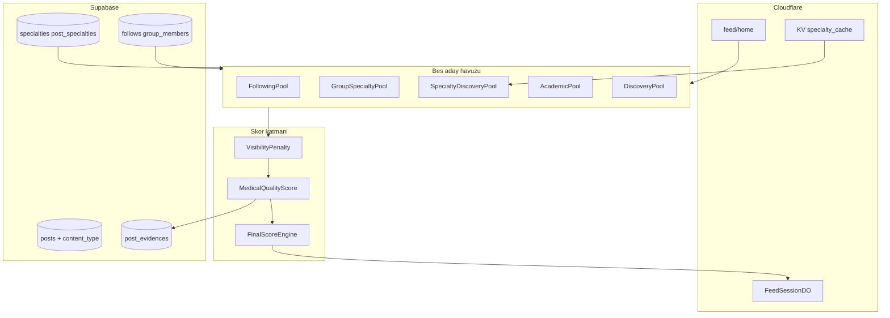

# Feed Ranking Algoritmasi Plani (v2 — Uzmanlik + Kalite)

Referanslar:
- [social_graph_platform_dd42bd33.plan.md](.cursor/plans/social_graph_platform_dd42bd33.plan.md) §9
- Mevcut sema: [post_evidences](supabase/migrations/20260615000005_posts_content.sql), [feed_seen_items](supabase/migrations/20260615000008_moderation_feed.sql), [can_view_post](supabase/migrations/20260615000008_moderation_feed.sql)
- API: [supabase_cloudflare_api_temeli](.cursor/plans/supabase_cloudflare_api_temeli_53d0ba84.plan.md)
- Onceki taslak: `feed_ranking_algoritmasi_5fafa2d2.plan.md` (serbest tag modeli **iptal** — asagida uyumluluk aciklanir)

---

## Uyumluluk taahhudu (hicbir seyle celismez)

| Mevcut kural | Feed plani davranisi |
|--------------|---------------------|
| User yalnizca gruplara post | **GroupSpecialty pool** korunur; user feed'i grup agirlikli |
| Takip yalnizca pro/page | **Following pool** yalnizca duvar postlari (`group_id IS NULL`) |
| Pro/page evidence zorunlu | **MedicalQualityScore** evidence'den turetilir; celismez, guclendirir |
| `post_type` = standard/quote/repost | Korunur; ayri **`content_type`** eklenir (icerik turu) |
| `moderation_state`, `reports` | **VisibilityPenalty** — aday havuzundan cikar veya skor dusur |
| Grup feed kronolojik (Reddit) | **Degismez** — `GET /v1/feed/groups/{slug}` mixer kullanmaz |
| fan-out-on-read | Korunur; specialty pool'lar **read-time veya KV cache**, inbox yok |
| `packages/shared` config const | Tum agirliklar `feed.ts` — env degil |

**v1 planindan degisen tek buyuk karar:** serbest `tags` → kontrollu **`specialties`** katalogu. Implicit ilgi `user_specialty_weights` olarak kalir.

---

## Hedefler

- **Home:** 5 havuzlu mixer + **FinalScore** (kalite %50 baskin)
- **Grup / profil:** Saf kronolojik (mixer yok)
- **Her post:** en az 1 specialty (pro/page composer zorunlu; grup postu grup specialty inherit)
- **Olcek:** ~2M kullanici, ~65k gunluk icerik

## Hedef disi (v1)

- ML/embedding, FDA/EMA otomatik ingest, fan-out-on-write, granular author tier (profesor/ogrenci credential)

---

## Feed yuzeyleri

| Yuzey | Endpoint | Algoritma |
|-------|----------|-----------|
| Home | `GET /v1/feed/home` | 5-pool mixer + FinalScore |
| Grup | `GET /v1/feed/groups/{slug}` | Keyset kronolojik |
| Profil duvar | `GET /v1/feed/profiles/{slug}` | Kronolojik + `is_pinned` |
| Impression | `POST /v1/feed/impressions` | Batch olay |
| Specialty oneri | `GET /v1/specialties` | Katalog listesi |

---

## Mimari



---

## Bes havuz tanimi

Pool basina max **200 aday**, pencere **7 gun** (config).

| Pool | Oran default | Kaynak | Not |
|------|--------------|--------|-----|
| **Following** | 30% | `follows` + duvar postlari | Pro/page/hastane/dernek |
| **GroupSpecialty** | 35% | `group_members` + postlar | User hesaplari icin kritik |
| **SpecialtyDiscovery** | 10% | Public postlar, kullanicinin specialty eslesmesi, takip disi | On hazir specialty pool (KV) |
| **Academic** | 10% | `content_type IN (guideline_update, drug_update, research_summary)` + yuksek MQS | Kılavuz/calışma agirlikli |
| **Discovery** | 15% | Public, verified + MQS esik, takip disi | Muhafazakar keşif |

**Cold start profili:** Following 0% / GroupSpecialty 35% / SpecialtyDiscovery 15% / Academic 15% / Discovery 35%

Oranlar `mixerProfile` ile kullanici baglamina gore secilir (takip sayisi, grup uyeligi, explicit specialty varligi).

### Specialty pool on-hazirlama (performans)

Cron/Worker (saatlik):
- Her `specialty_id` icin son 7 gun public post ID listesi → KV `feed:specialty:{slug}:candidates`
- Read-time: kullanicinin `user_specialties` ile KV key'lerinden aday birlestir

Social graph'taki **grup takip yok** kurali bozulmaz; grup uyeligi GroupSpecialty pool'da kalir.

---

## Uzmanlik katalogu (serbest tag yerine)

### FEED-1 migration

```
specialties
  id uuid PK
  slug citext unique          -- cardiology, internal_medicine
  name_tr, name_en text
  parent_id uuid FK nullable  -- dahiliye > kardiyoloji hiyerarsisi (opsiyonel v1)
  sort_order int
  is_active boolean

post_specialties
  post_id, specialty_id PK    -- min 1 zorunlu (trigger veya edge)

user_specialties              -- explicit ilgi
  profile_id, specialty_id PK
  source enum: onboarding, manual, inferred
  weight numeric default 1.0

group_specialties
  group_id, specialty_id PK   -- grup konusu

profile_specialties           -- pro/page yazar uzmanligi
  profile_id, specialty_id PK

user_specialty_weights        -- implicit agregat
  profile_id, specialty_id PK
  weight numeric, updated_at
```

**Seed:** Kardiyoloji, Nöroloji, Ortopedi, Psikiyatri, Pediatri, Endokrinoloji, Dahiliye, Onkoloji, Acil Tip, Farmakoloji (+ slug EN).

**Post specialty kaynagi:**
1. Composer'dan secim (pro/page zorunlu, max 3)
2. Grup postu: `group_specialties` otomatik inherit
3. v1.1: yazar `profile_specialties` varsayilan oneri

**Implicit ilgi:** onceki tag weight mantigi — olaylar post'un specialty'lerine weight yazar; explicit floor + 0.6 cap.

---

## content_type (yeni enum — post_type ile karistirilmaz)

FEED-1 migration:

```sql
create type public.content_type as enum (
  'case_study', 'research_summary', 'clinical_question', 'discussion',
  'guideline_update', 'drug_update', 'patient_education', 'conference_summary'
);
alter table posts add column content_type public.content_type default 'discussion';
```

- **Academic pool** filtresi: `guideline_update | drug_update | research_summary`
- **Mixer cesitliligi:** sayfa basina ayni `content_type` max 3 kart (config)

`create-post` edge function guncellenir: `contentType` + `specialtyIds[]` body alani.

---

## MedicalQualityScore (MQS)

Yayin aninda veya `content-pipeline-collect` sonrasinda **bir kez** hesaplanir; `posts.metadata.quality` veya kolon `quality_score int 0-100`.

Mevcut [post_evidences](supabase/migrations/20260615000005_posts_content.sql) kullanilir:

| Sinyal | Puan |
|--------|------|
| `source_type = clinical_guideline` | +40 |
| `identifier_type IN (doi, pmid, pmcid)` | +30 |
| Herhangi evidence satiri | +15 |
| `profiles.is_verified` | +10 |
| **AuthorTrustTier** (v1 asagida) | +0–5 |
| `moderation_state != none` veya acik report esik | **VisibilityPenalty** (havuz disi veya -100) |

Pro/page icin evidence zaten zorunlu → MQS taban puani yuksek baslar.

UI (v1.1): dusuk MQS + opinion-only evidence → `"Bu bilgi sinirlı dogrulanmistir"` etiketi (`posts.metadata.disclaimer`).

---

## AuthorTrustTier (v1 — basit, credential yok)

Mevcut `account_kind` + `is_verified`; yeni credential tablosu **v1'de yok**:

| Tier | Kosul | MQS katkisi |
|------|-------|-------------|
| 5 | verified professional | +5 |
| 3 | professional (onaysiz) | +3 |
| 4 | page (hastane/dernek) | +4 |
| 1 | user | +1 |

Feed siralamasinda tek basina baskin degil; yalnizca MQS icinde. v2: `professional_credentials` ile profesor/asistan ayrimi.

**Not:** "Hasta=20" modeli uygulanmaz — `user` hem hasta hem ogrenci olabilir; ayirt etmeden dusuk katki.

---

## FinalScore (kalite baskin)

```
RelationshipScore =
  is_following_author * 1.0
+ is_group_member_post * 0.8
+ specialty_match(user, post) * 1.0   -- explicit + min(implicit, 0.6)

FreshnessScore = exp_decay(published_at, half_life=24h)

EngagementScore = log(1 + reaction_count + 2*comment_count)

FinalScore =
  normalize(MQS)           * 0.50
+ FreshnessScore           * 0.20
+ RelationshipScore        * 0.20
+ EngagementScore          * 0.10
- seen_penalty
- author_fatigue_penalty
- visibility_penalty
```

**Trend (v2):** `TrendScore = MQS * 0.7 + EngagementScore * 0.3` — ayri trending endpoint.

Tum katsayilar [packages/shared/src/config/feed.ts](packages/shared/src/config/feed.ts).

---

## Dedup ve cesitlilik

1. `post_id` tek gosterim
2. Quote/repost zinciri dedup (`quote_of_id`)
3. Yazar ardisikligi max 2
4. `content_type` cesitliligi (MMR-lite)
5. `feed_seen_items` + FeedSession DO session seen

---

## Sema genisletmeleri (migration sirasi)

| ID | Icerik |
|----|--------|
| FEED-1 | `specialties`, junction tablolar, `content_type` enum + kolon, seed specialties |
| FEED-2 | `quality_score` veya `metadata.quality`, `feed_impressions`, indexler |
| FEED-3 | RLS yeni tablolar; `can_view_post` genisletme (`page_followers`, `professionals_only`) |
| FEED-4 | Trigger: pro/page post min 1 specialty; grup inherit (opsiyonel DB trigger) |

`feed_seen_items` **korunur**; `feed_impressions` ayri (dwell/click/dismiss).

---

## Cloudflare + API

| Bilesen | Gorev |
|---------|--------|
| `apps/api/src/routes/feed/` | home, group, profile, impressions |
| `FeedSessionDO` | cursor, seen, mixerProfile, lastAuthors |
| KV | specialty candidate cache, implicit weight cache |
| Cron | specialty pool refresh |

**Guncellenen edge:** [create-post](supabase/functions/create-post/index.ts) — `contentType`, `specialtyIds`, MQS hesapla yaz.

---

## API ozeti

- `GET /v1/feed/home?cursor=&limit=`
- `GET /v1/feed/groups/{slug}` — kronolojik
- `GET /v1/feed/profiles/{slug}` — kronolojik
- `POST /v1/feed/impressions`
- `GET /v1/specialties` — katalog
- `PUT /v1/me/specialties` — explicit CRUD
- `POST /v1/posts` (veya create-post edge) — specialty + content_type zorunluluklari

---

## Uygulama fazlari

### Faz A — Supabase semantik (bagimsiz)
FEED-1..4 migration; seed specialties; create-post guncelleme; docs

### Faz B — Kopru feed (Worker)
§9.1 gecici home + grup/profil kronolojik (mixer yok)

### Faz C — 5-pool mixer + MQS + FinalScore + FeedSession DO

### Faz D — Implicit specialty weights (impressions → user_specialty_weights)

### Faz E — Specialty KV cache cron, A/B mixer, TrendScore v2

---

## Dokumantasyon guncellemeleri

- [docs/supabase/feed-ranking.md](docs/supabase/feed-ranking.md) (yeni)
- Tablo docs: `specialties`, `post_specialties`, `user_specialties`, `feed_impressions`
- [social_graph_platform plan](.cursor/plans/social_graph_platform_dd42bd33.plan.md) §9 link + `feed-algorithm-plan` todo completed
- [docs/supabase/architecture.md](docs/supabase/architecture.md) Feed bolumu genislet

---

## Riskler

| Risk | Azaltma |
|------|---------|
| Specialty secimi yuku (composer) | Grup inherit + yazar varsayilan + max 3 |
| Academic pool bos | Baslangicta content_type filtre + dusuk MQS esik; editorial seed (v1.1) |
| MQS gaming (sahte DOI) | v2 pipeline DOI dogrulama; v1 manuel report |
| 5 pool gecikmesi | Paralel fetch + KV specialty cache |
