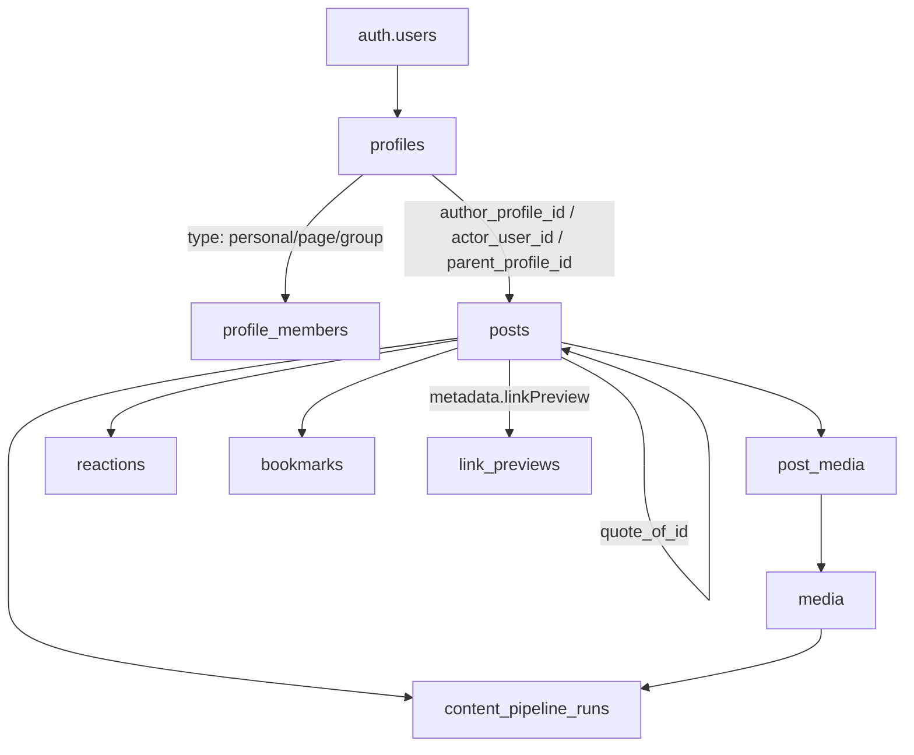
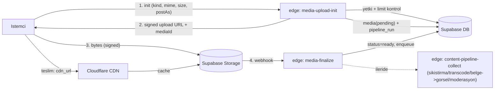

# Post Sistemi Planı

`___mm` referans alınarak, mevcut boş cloud projemize (`mm-prod` / `byehsoceqvvxeqejicag`) MCP ile uygulanacak. Cloud şu an tamamen boş; daha önce yazdığımız basit `init_schema` migration'larını bu yeni tasarımla **değiştireceğiz** (drift yok).

## Kararlar (alındı, ayarlanabilir)
- Profil/hedef: Universal Profile (`personal/page/group`) + `profile_members` + izinler.
- Depolama: Supabase Storage, önünde Cloudflare CDN (cache); upload Supabase edge-function üzerinden (signed upload URL deseni).
- Yanıtlar post olarak modellenir (`reply_to_id` + `root_post_id` + `depth`), ayrı comments tablosu yok. Derinlik config ile sınırlanır.
- Tüm limitler/ayarlar `packages/shared` config'inde const; edge (Deno) için `supabase/functions/_shared/config.ts` aynası.
- Bugün: tam şema + RLS + storage + upload/pipeline/createPost/link-preview iskeleti. Ertelenen: gerçek sıkıştırma/transcode/belge->görsel ve CDN DNS/cache kurulumu.

## Veri Modeli (özet ilişkiler)

## Yükleme + Pipeline akışı (signed upload URL)

## 1. Shared Config (`packages/shared`)
Minimal paket (ağır tooling yok), tek doğruluk kaynağı. Edge için Deno aynası.
- `packages/shared/src/config/post.ts`:
  - `POST_BODY_MAX_CHARS = 2000` (plain text üzerinden sayılır)
  - `POST_REPLY_MAX_DEPTH = 3`, `POST_QUOTE_NESTED_LEVELS = 1`
  - `POST_MEDIA = { maxImages: 4, maxVideos: 1, imageMaxBytes, videoMaxBytes, allowedImageMimes, allowedVideoMimes }`
  - `POST_ATTACHMENTS = { max, maxBytes, allowedMimes: pdf/doc/docx/xls/xlsx/ppt/pptx/txt/csv }`
  - `STORAGE_BUCKETS = { avatars, postMedia: 'post-media', postAttachments: 'post-attachments' }`
  - `CDN = { baseUrl, imageTargetFormat: 'avif|webp', videoTarget: 'h264/hls' }`
- `packages/shared/src/config/visibility.ts`, `index.ts`.
- `supabase/functions/_shared/config.ts`: yukarıdakinin Deno const aynası (Faz 2'de unify edilecek; not düşülür).

## 2. Migrations (yeniden yazılır)
Mevcut [supabase/migrations/20260614130000_init_schema.sql](supabase/migrations/20260614130000_init_schema.sql), [rls_policies](supabase/migrations/20260614130100_rls_policies.sql), [storage_policies](supabase/migrations/20260614130200_storage_policies.sql) ve [seed.sql](supabase/seed.sql) bu tasarıma göre yeniden düzenlenir. `private` şema + `citext` korunur.

### 2.1 profiles (universal)
`id, owner_id->auth.users, type ('personal'|'page'|'group'), username citext unique, display_name, bio, avatar_url, banner_url, metadata jsonb (group/page policy), is_verified, follower_count, following_count, post_count, member_count, created_at, updated_at`. `handle_new_user` trigger personal profil açar.

### 2.2 profile_members + izinler (`private` şema)
`profile_members(profile_id, user_id, role ('owner'|'admin'|'editor'|'member'), status, created_at, unique(profile_id,user_id))`. Helper'lar: `private.is_member_of(profile_id,user_id)`, `private.can_post_as(profile_id,user_id)` (personal sahibi VEYA page/group'ta yetki).

### 2.3 follows
`follows(follower_profile_id, following_profile_id, created_at, pk, no-self)` + ters index. Sayaç trigger'ları profillere.

### 2.4 posts
`id, author_profile_id, actor_user_id, parent_profile_id, content jsonb (Lexical), content_plain text, post_type ('standard'|'repost'|'reply'|'quote'), visibility ('public'|'followers'|'mutual'|'private'|'group_only'|'members_only'|'unlisted'), reply_policy, allow_reactions, allow_shares, reply_to_id->posts, root_post_id->posts, depth int, quote_of_id->posts, status ('draft'|'published'|'scheduled'|'archived'), scheduled_at, primary_media_id, language, reaction_count, reply_count, quote_count, bookmark_count, view_count, is_pinned, is_sensitive, is_hidden, is_flagged, metadata jsonb (linkPreview), created_at, updated_at, edited_at, deleted_at (soft delete)`. Indexler: `(author_profile_id, created_at desc) where deleted_at is null`, `(parent_profile_id, created_at desc)`, `(reply_to_id)`, `(root_post_id)`, GIN FTS `to_tsvector('turkish', content_plain)`, GIN `metadata`. `depth`/`root_post_id` trigger ile hesaplanır ve `POST_REPLY_MAX_DEPTH` aşılırsa reddedilir.

### 2.5 media + post_media
`media(id, owner_profile_id, uploader_user_id, kind ('image'|'video'|'document'), bucket, path, mime_type, file_size, width, height, duration_ms, blurhash, variants jsonb, status ('pending'|'processing'|'ready'|'failed'), processing_error, created_at, unique(bucket,path))`. `post_media(post_id, media_id, display_order, alt_text, unique(post_id,media_id))`. `cdn_url` uygulamada `CDN.baseUrl + path` ile türetilir.

### 2.6 reactions + bookmarks
`reactions(profile_id, post_id, type default 'like', created_at, pk(profile_id,post_id,type))` ve `bookmarks(profile_id, post_id, created_at, pk)`. Sayaç trigger'ları `posts.reaction_count` / `bookmark_count`; reply/quote sayaçları parent post'a trigger ile.

### 2.7 link_previews (OG cache) + content_pipeline_runs
- `link_previews(url_hash pk, url, title, description, image_url, site_name, fetched_at)` — OG cache; post `metadata.linkPreview` referans verir.
- `content_pipeline_runs(id, resource_type ('post'|'media'), resource_id, actor_user_id, actor_profile_id, idempotency_key unique, pipeline_version, context jsonb, status ('context_recorded'|'processing'|'done'|'failed'), source, request_id, created_at, updated_at)` — `___mm` deseni (`recordContentPipelineRun`).

### 2.8 RLS
Tüm tablolarda RLS açık, `(select auth.uid())` sarmalı.
- posts SELECT: visibility-duyarlı (public/followers/mutual/private/group_only/members_only/unlisted) + `deleted_at is null` + yazar kendi her şeyini görür.
- posts INSERT: `actor_user_id = auth.uid()` AND `private.can_post_as(author_profile_id, auth.uid())`.
- posts UPDATE/DELETE: yazar veya yetkili (soft delete = `update deleted_at`).
- media/post_media/reactions/bookmarks: sahiplik + parent post yetkisi.
- link_previews: authenticated read; yazma service_role/edge.

### 2.9 Storage
[supabase/config.toml](supabase/config.toml)'a `post-attachments` bucket eklenir (avatars, post-media zaten var). `storage.objects` politikaları klasör-tabanlı (`<profile_id>/...`) sahiplik; public postların medyası CDN-cache için public-read, private/followers için signed URL (edge üretir).

## 3. Edge Functions (Supabase, `supabase/functions/`)
- `media-upload-init`: auth + `can_post_as` + config limit kontrolü (kind/mime/size/sayı) → `media(pending)` + `content_pipeline_runs` kaydı → `createSignedUploadUrl` döner.
- `media-finalize`: storage webhook/çağrı → `media.status='ready'` (ileride 'processing' + collect tetikler).
- `content-pipeline-collect`: iskelet; gelecekte sıkıştırma (avif/webp), video transcode (h264/HLS), belge→görsel (LinkedIn tarzı; LibreOffice/Gotenberg gibi ağır runtime gerektirir, harici servis/queue ile — not düşülür), içerik/yasal moderasyon. Bugün no-op + durum geçişi.
- `create-post`: Lexical `content` + `content_plain` doğrulama (boş kontrolü `___mm`'deki [post-lexical-serialized.ts](D:/PROJECTS/NodejsProjects/___mm/src/lib/post-lexical-serialized.ts) mantığı), `POST_BODY_MAX_CHARS` kontrolü, post insert + `post_media` bağlama + reply/quote `depth` hesap + `content_pipeline_runs(post)` kaydı.
- `link-preview`: verilen URL'nin OG bilgisini sunucu tarafında çeker, `link_previews`'e cache'ler, döner.
- `_shared/`: mevcut `cors.ts`, `supabase.ts`, `log.ts` + yeni `config.ts`, `pipeline.ts` (record helper), `lexical.ts` (plain extraction + char count).

## 4. Cloudflare CDN
- `media.path` üzerinden teslim `CDN.baseUrl` ile; public bucket nesneleri CF cache'lenir.
- DNS/cache-rule/custom domain kurulumu **sonraki faza** (config sabiti hazır; gerçek proxy kurulumu ayrı adım).

## 5. Cloud'a Uygulama (MCP)
- `apply_migration` ile sırayla migration'lar; `list_tables` + `get_advisors` ile doğrulama.
- `deploy_edge_function` ile fonksiyonlar.
- Seed cloud'a uygulanmaz (production); gerekirse ayrı test-data adımı.

## Kapsam Dışı (sonraki fazlar)
- Gerçek görsel/video sıkıştırma, transcode, belge→görsel dönüşümü (ağır runtime/queue).
- Cloudflare CDN DNS/cache fiziksel kurulumu.
- Web (Lexical editör UI) ve mobil — Faz 3/4.
- `evidences` (tıbbi atıf) — opsiyonel, istenirse eklenir.