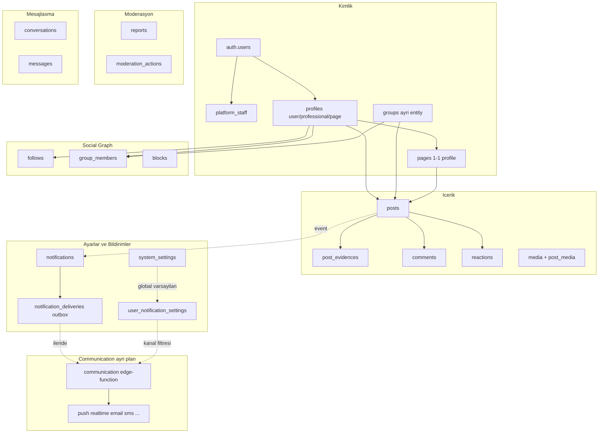
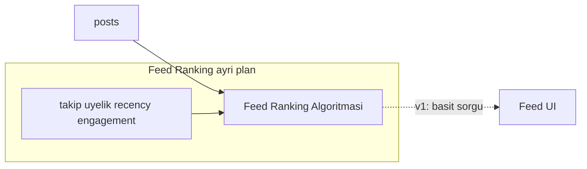
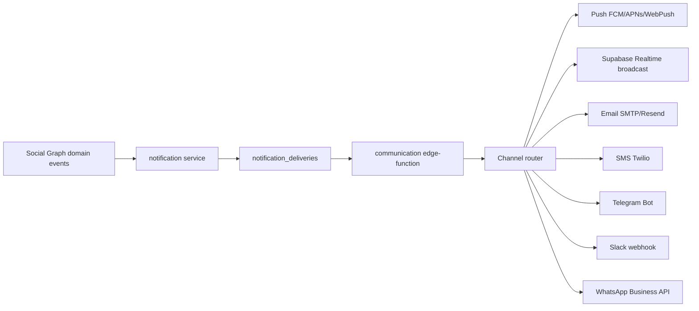

# Social Graph Platform Planı

Önceki [post_sistemi planı](.cursor/plans/post_sistemi_2a9fa405.plan.md) bu planla **birleştirilir ve genişletilir**. Cloud `mm-prod` (`byehsoceqvvxeqejicag`) boş; mevcut basit migration dosyaları ([20260614130000_init_schema.sql](supabase/migrations/20260614130000_init_schema.sql) vb.) yeniden yazılır.

Referans: [___mm](D:/PROJECTS/NodejsProjects/___mm) — Lexical gövde, `post_evidences`, composer anatomisi, `content_pipeline_runs`, visibility matrisi.

## Mimari özet





---

## 1. Kimlik katmanı

### 1.0 Platform kullanıcıları (`platform_staff`)
- `auth.users` ile giriş; **ayrı profil duvarı yok**.
- Tablo: `platform_staff(user_id, role, permissions text[], status, created_at)`.
- Roller: `super_admin`, `moderator`, `support`, `content_ops` (genişletilebilir).
- Yetki kontrolü: `private.is_platform_staff(user_id, permission)` — RLS bypass değil, admin API/edge ile.
- Profesyonel onay, moderasyon kararları, page oluşturma (opsiyonel) bu katmandan.

### 1.1 Profiller (`profiles`) — gruplar **dahil değil**
Ortak kabuk: `id`, `owner_user_id` (user/professional için), `account_kind` (`user` | `professional` | `page`), `slug` (unique, citext), `display_name`, `bio`, `avatar_url`, `banner_url`, `visibility_settings jsonb`, `follower_count`, `following_count`, `post_count`, `is_verified`, `created_at`, `updated_at`, `deleted_at`.

| Tür | Route | Wall | Post yetkisi |
|-----|-------|------|--------------|
| **User** | `user/<slug>` | Yok | **Sadece gruplara** |
| **Professional** | `user/<slug>` | Var | Kendi wall + grup + page wall + **page adına** |
| **Page** | `mm/<slug>` | Var | Kendi wall + gruplar |

- Kayıt: `handle_new_user` → `account_kind=user` profil açar.
- **Professional upgrade**: `professional_applications(user_id, status pending/approved/rejected, submitted_at, reviewed_by, notes)` — **admin onayı zorunlu**; onayda `account_kind=professional`.
- Page oluşturma: onaylı professional veya platform staff → `profiles(account_kind=page)` + `pages` satırı.

### 1.2 Pages (`pages`)
`profile_id` (1:1), `created_by_user_id`, `visibility` (`public`|`private`), `settings jsonb` (mesaj alma, yorum politikası), `member_count`. Üyelik: `page_members(page_id, profile_id, role owner/admin/member, status)`.

### 1.3 Groups (`groups`) — **profiles’tan tamamen ayrı**
`id`, `slug` (unique, `r/` prefix UI’da), `name`, `description`, `avatar_url`, `banner_url`, `visibility` (`public`|`private`|`secret`), `join_policy` (`open`|`request`|`invite_only`), `rules jsonb`, `settings jsonb`, `member_count`, `post_count`, `created_by_profile_id`, `created_at`. **Takip yok** — yalnızca `group_members`.

- Üyelik: `group_members(group_id, profile_id, role owner/admin/moderator/member, status active/pending/banned, banned_until, banned_reason)`.
- Başvuru: `join_policy=request` → `status=pending` + admin onay.
- Grup **asla** post yazmaz, takip etmez, mesaj almaz; wall’ına **başkaları** yazar.

---

## 2. Social graph kuralları

### 2.1 Takip (`follows`)
`follower_profile_id`, `following_profile_id`, `created_at`, PK, no-self.

| Takip eden | Takip edebilir | Takip edilebilir mi? |
|------------|----------------|---------------------|
| User | professional, page | Hayır |
| Professional | professional, page | Evet |
| Page | professional, page | Evet (page profili) |
| Group | — | Hayır |

DB check: `following` profili `account_kind IN (professional, page)`.

### 2.2 Grup üyeliği
Post/yorum için **üyelik** gerekir (`group_members.status=active`). Public + `join_policy=open` → otomatik active. Private/secret → request veya invite.

### 2.3 Engelleme (`blocks`)
`blocker_profile_id`, `blocked_profile_id`, `created_at`. Feed, mesaj, yorum, mention ve görünürlük sorgularında filtre.

---

## 3. Post sistemi

### 3.1 Post anatomisi (___mm + senin kuralların)

```
posts
  id, author_profile_id, actor_user_id
  group_id              -- gruba atildiysa (groups.id)
  page_context_id       -- page duvarina (baskasinin/page wall) atildiysa -> pages.profile_id
  content jsonb         -- Lexical EditorState
  content_plain text    -- FTS + karakter sayaci (max 2000, config)
  post_type             -- standard | quote | repost
  quote_of_id           -- alinti/repost hedefi
  visibility            -- baglama gore (asagidaki matris)
  reply_policy          -- everyone | followers | members | none
  allow_comments, allow_reactions, allow_reposts
  status                -- genis lifecycle (3.3)
  moderation_state      -- ayri moderasyon ekseni (3.3)
  processing_state      -- medya/pipeline (3.3)
  metadata jsonb        -- linkPreview, composerBg, placementPreview (grup/page etiketi UI)
  scheduled_at, published_at, edited_at, deleted_at
  reaction_count, comment_count, repost_count, view_count
  primary_media_id
```

**Yerleşim kuralları (DB constraint + edge validation):**

| Senaryo | author | group_id | page_context | Not |
|---------|--------|----------|--------------|-----|
| User → grup | user profil | set | null | Tek user post yolu |
| Pro → kendi wall | professional | null | null | Evidence zorunlu |
| Pro → grup | professional | set | null | Evidence zorunlu |
| Pro → page duvarı (kendi adına) | professional | null | page | Evidence zorunlu |
| Pro → **page adına** (switcher) | **page** | null/null/set | actor yetkili | Evidence zorunlu |
| Page → kendi wall | page | null | null | Evidence zorunlu |
| Page → grup | page | set | null | Evidence zorunlu |
| Quote/Repost | ayni kurallar | quote_of_id set | | Evidence asagida |

**Public grup → page timeline yansıması:** Page adına grup postu + `groups.visibility=public` → page timeline sorgusuna dahil (`author_profile_id=page AND group_id IS NOT NULL AND group.public`).

**Compose UI:** Hedef seçilince `metadata.placementPreview` ile grup/page etiketi gösterilir (___mm `post-card` deseni).

### 3.2 Evidence (`post_evidences`) — ___mm şeması
`source_type` (publication, clinical_guideline, book, news_article, external_url, own_experience, **own_opinion**, other), identifier alanları, title, authors, url, note, `display_order`.

**Zorunluluk:**
- `author.account_kind IN (professional, page)` → en az 1 evidence **veya** geçerli quote devralma.
- `author.account_kind = user` (grup postu) → evidence **zorunlu değil**.

**Quote/Repost evidence devralma (önerilen kural):**
1. `post_type IN (quote, repost)` ve `quote_of_id` doluysa, hedef postta evidence varsa → yeni evidence **gerekmez**.
2. Hedef de quote/repost ve kendi evidence’si yoksa → `quote_of_id` zincirinde **kök `standard` posta** kadar recursive bak; kökte evidence varsa yeterli.
3. Zincirde hiç evidence yoksa → yeni postta evidence **zorunlu** (own_opinion dahil).
4. `repost` (yorumsuz) → tamamen devral; `quote` (repost-at) → kullanıcı yeni metin ekliyorsa evidence yine devralma ile geçilebilir (içerik iddiası yoksa).

### 3.3 Post status (geniş)
İki eksen + lifecycle:

**`status`:** `draft` | `scheduled` | `publishing` | `published` | `archived` | `deleted`

**`moderation_state`:** `none` | `pending_review` | `flagged` | `under_review` | `hidden` | `removed` | `rejected`

**`processing_state`:** `none` | `media_pending` | `pipeline_queued` | `pipeline_processing` | `pipeline_failed`

Geçiş örnekleri: create → `published` + `processing_state=media_pending` → pipeline bitince `none`; report → `flagged`; mod kararı → `hidden`/`removed`. Feed sorguları: `status=published`, `moderation_state IN (none)`, `deleted_at IS NULL`.

### 3.4 Gizlilik matrisi (bağlama göre UI seçenekleri)

| Bağlam | Seçilebilir visibility |
|--------|------------------------|
| Professional kendi wall | `public`, `followers`, `professionals_only`, `unlisted` |
| Page kendi wall | `public`, `page_followers`, `professionals_only`, `unlisted` |
| Page duvarına (pro yazar) | `public`, `page_followers`, `professionals_only` |
| Grup içi | `group_only` (+ public grup → author timeline mirror kuralları) |

`packages/shared/src/config/visibility.ts` — bağlam → izinli enum listesi.

### 3.5 Medya ve belgeler
Config ([packages/shared](packages/shared)):
- `POST_BODY_MAX_CHARS = 2000`
- Medya: max **4** slot, max **1 video**, geri kalan image; MIME/size limitleri
- Ekler: max **3** dosya (pdf, doc/docx, xls/xlsx, ppt/pptx, txt, csv)
- OG: link preview zorunlu fetch (edge `link-preview`)

Upload: signed URL edge pipeline ([önceki plan](.cursor/plans/post_sistemi_2a9fa405.plan.md)); tüm dosyalar `media-upload-init` → Storage → `media-finalize` → `content-pipeline-collect` (bugün iskelet; sıkıştırma/transcode/belge→görsel sonraki faz). CDN: Supabase Storage + Cloudflare cache (config const).

---

## 4. Yorum sistemi (`comments`) — post’tan ayrı

```
comments
  id, post_id, author_profile_id, actor_user_id
  parent_comment_id, thread_depth (max 3, config)
  content jsonb (Lexical) veya text
  status, moderation_state (post ile ayni eksenler)
  created_at, updated_at, deleted_at
```

| Yazar | Yorum yapabilir |
|-------|-----------------|
| User | Görme yetkisi olan pro/page/grup postları + üye olduğu grup |
| Professional / Page | Görme yetkisi olan her post |
| Group | Hayır |

Evidence: yorumlarda **zorunlu değil** (v1).

---

## 5. Like sistemi (`reactions`)

`reactions(profile_id, post_id, type='like', created_at)`. User, professional, page — görme yetkisi varsa. Grup like edemez. Sayaç trigger → `posts.reaction_count`.

---

## 6. Repost / Repost-at (quote)

- **Repost:** `post_type=repost`, `quote_of_id`, içerik boş olabilir, evidence devralma.
- **Repost-at (quote):** `post_type=quote`, `quote_of_id` + Lexical içerik, evidence devralma kuralları (3.2).
- UI: max **1 seviye** iç içe quote snapshot (___mm `quoted-post-embed`).
- `allow_reposts` post bayrağı + visibility kontrolü.

---

## 7. Mesajlaşma (Faz 1b veya Social Graph Faz 2)

```
conversations(id, type direct, created_at)
conversation_participants(conversation_id, profile_id, last_read_at)
messages(id, conversation_id, sender_profile_id, actor_user_id, content, attachments, created_at, edited_at, deleted_at)
```

| Gönderen | Alabilir |
|----------|----------|
| User | professional, page |
| Professional | professional, page, (page member user’lar) |
| Page | professional, page |
| Group | — |

RLS: katılımcılar + block filtresi. Medya: aynı upload pipeline, ayrı bucket `message-media`.

---

## 8. Moderasyon ve gizlilik

### 8.1 Şikayet (`reports`)
`reporter_profile_id`, `target_type` (post|comment|profile|message), `target_id`, `reason_code`, `details`, `status` (open|reviewing|resolved|dismissed), `created_at`.

### 8.2 Moderasyon aksiyonları (`moderation_actions`)
`moderator_user_id`, `target_type`, `target_id`, `action` (hide|remove|warn|ban|restore), `reason`, `metadata`, `created_at`. Post/comment `moderation_state` güncellenir.

### 8.3 Grup moderasyonu
`group_members.status=banned`, moderatör `group_members.role IN (owner,admin,moderator)`.

### 8.4 Profil gizliliği
`profiles.visibility_settings`: kimler mesaj atabilir, profili kim görür, professional-only mod. RLS helper’larda kullanılır.

---

## 9. Feed

> **Bu planda feed ranking algoritması uygulanmaz.** Ayrı bir plan dokümanında tasarlanacak: [Feed Ranking Algoritması](.cursor/plans/feed_ranking_algoritmasi.plan.md) *(henüz oluşturulmadı — Social Graph uygulaması sırasında referans olarak eklenecek)*.

### 9.1 v1 (Social Graph uygulaması — geçici, basit)
Fan-out-on-read; algoritma planı gelene kadar yalnızca **görünürlük + kronoloji + basit takip boost**:

1. Public içerik (anon dahil)
2. Takip edilen professional/page postları (recency boost)
3. Grup üyelik feed’leri (`group_only`)
4. Engelleme filtresi
5. Keyset pagination (`created_at, id`)

Bu sorgu **geçici köprüdür**; feed algoritması planı onaylandığında skorlama, dedup, kişiselleştirme oradan devralınır.

### 9.2 Feed Ranking Algoritması (ayrı plan — şimdilik aksiyon yok)

Ayrı planda netleştirilecek başlıklar (yer tutucu):

| Bileşen | Açıklama |
|---------|----------|
| **Aday havuzu** | Takip, grup üyeliği, public keşif, trending (opsiyonel) |
| **Skor sinyalleri** | Recency, takip yakınlığı, engagement (like/comment/repost), author trust, evidence quality, moderation penalty |
| **Dedup / freshness** | `feed_seen_items`, quote zinciri tek gösterim, refresh’te yeni içerik |
| **Kişiselleştirme** | Profil türü (user vs pro), dil, grup ağırlığı |
| **Operasyon** | Materialized feed vs runtime skor; cache (KV/DO); A/B profilleri |
| **Config** | `packages/shared/config/feed.ts` — ağırlıklar const (env değil) |

Social Graph migration’larında yalnızca feed sorgusunun ihtiyaç duyduğu **index’ler** ve opsiyonel `feed_seen_items` iskeleti bırakılabilir; skor motoru **yapılmaz**.

---

## 10. Ayarlar katmanı (kullanıcı + sistem)

Birçok ilişki (bildirim, mesaj, görünürlük, feed) ayarlara bağlı. Üç katman:

### 10.1 Sistem ayarları (`system_settings`)
Platform geneli; platform staff yönetir.

```
system_settings
  key          text PK          -- orn. 'notifications.defaults', 'feed.public_anon_enabled'
  value        jsonb not null
  description  text
  updated_at   timestamptz
  updated_by   uuid -> auth.users
```

Örnek anahtarlar:
- `notifications.defaults` — yeni kullanıcı için varsayılan kanal matrisi
- `notifications.event_types_enabled` — global olarak kapalı event tipleri
- `messaging.allow_user_to_page` — global mesaj politikası
- `feed.public_anon_enabled` — anon feed açık/kapalı
- `professional.application_auto_reject_days`

Okuma: edge/API `system_settings` + `packages/shared` config fallback (config = kod sabiti, system_settings = runtime override).

### 10.2 Kullanıcı / profil ayarları

**Auth düzeyi** (`user_settings`) — `owner_user_id` bazlı, tüm profilleri etkiler:
```
user_settings
  user_id      uuid PK -> auth.users
  locale       text
  timezone     text
  preferences  jsonb    -- UI, erişilebilirlik, vb.
  updated_at
```

**Bildirim tercihleri** (`user_notification_settings`) — kanal × event matrisi:
```
user_notification_settings
  user_id           uuid -> auth.users
  profile_id        uuid nullable -> profiles  -- null = tüm profiller; dolu = page/pro context
  event_type        text   -- 'like', 'comment', 'follow', 'group_invite', 'message', ...
  channel           text   -- 'push' | 'realtime' | 'email' | 'sms' | 'telegram' | 'slack' | 'whatsapp' | 'in_app'
  enabled           boolean not null default true
  updated_at
  unique (user_id, coalesce(profile_id, '00000000-...'), event_type, channel)
```

**Profil düzeyi** (mevcut `profiles.visibility_settings` jsonb genişletilir):
- Kim mesaj atabilir
- Profil görünürlüğü
- Page: yorum/repost politikası

**Grup / page ayarları** — `groups.settings`, `pages.settings` jsonb (join policy, post policy, bildirim defaults for members).

### 10.3 Ayar çözümleme sırası (precedence)
1. Kullanıcı `user_notification_settings` (en spesifik: profile + event + channel)
2. `system_settings.notifications.defaults`
3. `packages/shared/config/notifications.ts` const fallback

Push kapalıysa → `communication` edge-function’a **push kanalı hiç gönderilmez** (outbox’ta `skipped: user_preference`).

---

## 11. Bildirim sistemi

In-app bildirim kaydı + teslimat outbox; **gerçek kanal gönderimi** ayrı `communication` edge-function’a devredilir.

### 11.1 Olay tipleri (`notification_event_types`)
Seed tablo: `like`, `comment`, `follow`, `repost`, `mention`, `group_join_request`, `group_join_approved`, `message`, `moderation_action`, `professional_application`, ...

Her tip: `default_channels jsonb`, `category` (social|system|marketing), `user_configurable boolean`.

### 11.2 Bildirim kaydı (`notifications`)
```
notifications
  id, recipient_user_id, recipient_profile_id nullable
  actor_profile_id nullable
  event_type, entity_type, entity_id
  title, body, payload jsonb
  read_at, created_at
```

In-app liste + Realtime (Supabase Realtime `notifications` subscribe) — **realtime kanalı** da `user_notification_settings` ile filtrelenir.

### 11.3 Teslimat outbox (`notification_deliveries`)
```
notification_deliveries
  id, notification_id
  channel            -- push | email | sms | ...
  status             -- pending | sent | failed | skipped
  skip_reason        -- user_preference | system_disabled | no_device_token
  provider_message_id, error, attempts, created_at, sent_at
```

Akış:
1. Domain event (like, comment, …) → `notifications` insert + `notification_deliveries` satırları (etkin kanallar için)
2. Ayar kontrolü **outbox oluşturulmadan önce** — kapalı kanal için delivery oluşturulmaz veya `skipped`
3. **İleride:** `communication` edge-function outbox’ı tüketir ve kanallara dağıtır

### 11.4 Cihaz tokenları (`user_devices`) — push için iskelet
`user_id`, `platform` (ios|android|web), `push_token`, `enabled`, `updated_at`.

Social Graph fazında tablo + RLS; FCM/APNs entegrasyonu **communication planında**.

---

## 12. Communication platform (ayrı plan — yapı iskeleti)

> **Detaylı uygulama ayrı planda:** [Communication Edge Function](.cursor/plans/communication_edge_function.plan.md) *(henüz oluşturulmadı)*. Social Graph bu planda yalnızca **sözleşme ve entegrasyon noktalarını** tanımlar.

### 12.1 Rol
Merkezi **çok kanallı ileti mesajlaşma katmanı**. Bildirimler, sistem e-postaları, moderasyon uyarıları, ileride marketing — hepsi buradan geçer.



### 12.2 Kanal arayüzü (plugin deseni)
Her kanal aynı sözleşmeyi uygular:
```
DeliverRequest { deliveryId, userId, channel, templateKey, payload, locale }
DeliverResult  { status, providerMessageId?, error? }
```

`communication/_shared/channels/` — kanal başına modül; yeni kanal = yeni plugin + config const.

### 12.3 Communication edge-function sorumlulukları (özet)
- Outbox poll veya webhook tetikleme (`notification_deliveries.status=pending`)
- Kullanıcı + sistem ayarı son kontrolü (race-safe)
- Template render (`notification_templates` — ileride)
- Rate limit / quiet hours (`user_settings.preferences.quiet_hours`)
- Retry, dead-letter, idempotency (`delivery_id`)
- Provider credential’ları secrets (wrangler/supabase secrets)

### 12.4 Social Graph ↔ Communication entegrasyon noktaları
| Social Graph üretir | Communication tüketir |
|---------------------|----------------------|
| `notifications` + `notification_deliveries` | Tüm outbound kanallar |
| `user_notification_settings` | Kanal filtresi |
| `system_settings` | Global kill switch |
| `user_devices.push_token` | Push kanalı |
| Mesajlaşma (ileride) | `message` event → push/email opsiyonel |

**Bu planda yapılacak:** outbox tablosu, ayar tabloları, event type seed, domain event’lerden outbox satırı üreten edge iskeleti (`emit-notification` — communication’a HTTP/enqueue, bugün no-op veya log-only).

**Bu planda yapılmayacak:** FCM, SMTP, Twilio, Telegram, Slack, WhatsApp provider entegrasyonları.

---

## 13. Account switcher (compose)

- Sadece **professional ↔ yönettiği page’ler** (`page_members` yetkili).
- `author_profile_id` seçimi; grup hedefi compose’da ayrı alan.
- User switcher yok (tek profil); grup yönetimi ayrı panel.

---

## 14. Shared config (`packages/shared`)

```
config/
  post.ts          -- char limit, media, attachments, depth
  visibility.ts    -- baglam -> visibility enum
  evidence.ts      -- source types, max count
  social.ts        -- follow rules, group join policies
  moderation.ts    -- report reason codes
  messaging.ts
  notifications.ts -- event types, default channels, channel enum
  feed.ts          -- v1 gecici sorgu limitleri; agirliklar feed algoritma planinda
  cdn.ts, storage.ts
```

Edge aynası: `supabase/functions/_shared/config.ts`.

---

## 15. Edge Functions (Supabase — Social Graph kapsamı)

| Function | Görev |
|----------|--------|
| `media-upload-init` / `media-finalize` | Signed upload + pipeline kaydı |
| `content-pipeline-collect` | İskelet (moderasyon/sıkıştırma sonraki faz) |
| `create-post` | Bağlam kuralları, evidence, visibility, placement |
| `link-preview` | OG cache |
| `create-comment` | Depth, visibility, RLS |
| `toggle-reaction` | Like idempotent |
| `submit-report` | Şikayet |
| `emit-notification` | Domain event → `notifications` + `notification_deliveries` (ayar filtresi); communication'a enqueue **iskelet** |

Platform/professional onay: admin edge veya dashboard (staff JWT).

**Communication edge-function** → ayrı plan; bu listede yok.

---

## 16. Migration fazları (cloud MCP)

1. **core** — extensions, private helpers, platform_staff, profiles, professional_applications, **system_settings**, **user_settings**
2. **entities** — pages, page_members, groups, group_members
3. **graph** — follows, blocks
4. **content** — posts, post_evidences, media, post_media, link_previews, content_pipeline_runs
5. **engagement** — comments, reactions, bookmarks (opsiyonel v1)
6. **notifications** — notification_event_types (seed), notifications, user_notification_settings, notification_deliveries, user_devices (iskelet)
7. **moderation** — reports, moderation_actions
8. **messaging** — conversations, messages (Faz 2’ye kaydırılabilir)
9. **rls** — tüm tablolar, visibility helper’ları (`private.can_view_post`, `private.can_post_to_group`, `private.should_notify_channel`, vb.)
10. **storage** — buckets + policies
11. **search** — FTS index posts + comments (___mm `search_index` sonraki faz)
12. **feed** — yalnızca index + opsiyonel `feed_seen_items` iskelet; **ranking algoritması yok**

Mevcut [init_schema](supabase/migrations/20260614130000_init_schema.sql) dosyaları silinip yukarıdaki sırayla yeniden yazılır.

---

## 17. ___mm’den alınan / bilinçli farklar

| ___mm | mediamedicine |
|-------|---------------|
| Universal profile (group=profile) | **Groups ayrı tablo**, üyelik only |
| User wall var | **User wall yok**, sadece grup postu |
| CHAR_LIMIT 12000 | **2000**, config |
| Client-side storage upload | **Edge signed upload + pipeline** |
| Comments + post reply_to | **Comments tablosu**; repost/quote post üzerinden |
| Evidence opsiyonel | **Pro/page zorunlu** + quote devralma |
| 4 attachment | **3 attachment**, 4 media |

---

## 18. Kapsam dışı / ayrı planlar

| Konu | Durum |
|------|--------|
| **Feed Ranking Algoritması** | Ayrı plan; skor motoru, A/B, materialized feed — **bu planda uygulanmaz** |
| **Communication edge-function** | Ayrı plan; push/email/sms/telegram/slack/whatsapp provider entegrasyonları |
| Web/mobile UI (Lexical composer, feed, switcher) | Faz 3/4 |
| Gerçek medya sıkıştırma, video transcode, belge→görsel | Sonraki faz |
| Cloudflare CDN DNS kurulumu | Sonraki faz |
| Poll, event post tipleri | Sonraki faz |
| Realtime presence | Ayrı plan |
