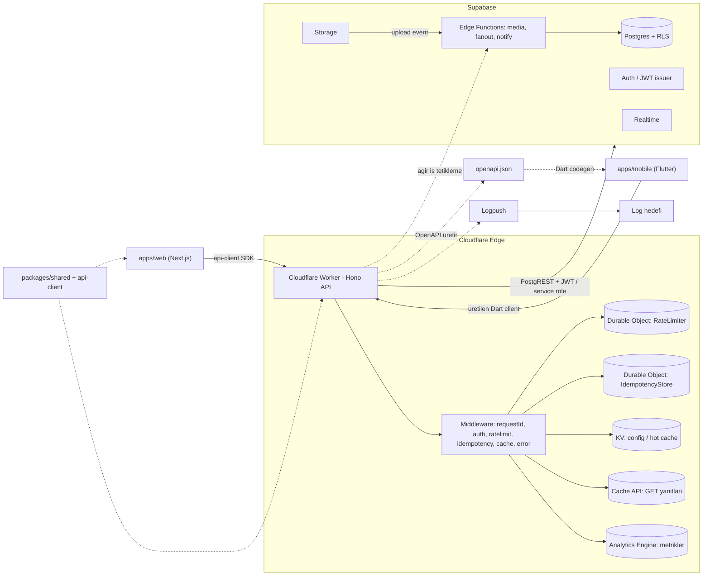

# Supabase + Cloudflare Workers API Temeli

## Mevcut Durum
Proje boş bir git deposu (yalnızca `.git` ve `.cursor`). Sıfırdan **hibrit monorepo** olarak kurulacak: JS tarafı (api + web + packages) pnpm + Turborepo ile yönetilir; Flutter mobil uygulaması Dart olduğu için JS workspace dışında, kendi araçlarıyla (`pub`/`flutter`) yaşar ama aynı repoda durur. Tüm state ve gözlemlenebilirlik **Cloudflare-native** (Durable Objects + KV + Cache API + Analytics Engine + Logpush) olacak.

## Fazlar (sıralı ilerleme)
1. **Faz 1 — Supabase temeli** (şu an): repo iskeleti + `supabase/` (config, şema/migrations + RLS, storage politikaları, Edge Functions iskeleti, seed). Lokal `supabase start` ile doğrulama.
2. **Faz 2 — API**: `apps/api` Cloudflare Worker (Hono) + middleware + Durable Objects + OpenAPI.
3. **Faz 3 — Web**: `apps/web` Next.js + `api-client`.
4. **Faz 4 — Mobil**: `apps/mobile` Flutter + Riverpod + Dart client.

## İstemci Stack'leri
- **Web**: Next.js (React + TanStack Query + Tailwind) — `packages/api-client` ve `packages/shared`'ı doğrudan tüketir.
- **Mobil**: Flutter (Dart) — JS paketlerini doğrudan tüketemez; ortak sözleşme API'den üretilen **OpenAPI spec → Dart client** ile taşınır. Supabase erişimi `supabase_flutter` SDK ile.
- **Paylaşım**: `packages/shared` (zod şemalar/tipler/hata kodları) + `packages/api-client` (tip-güvenli SDK). Tek doğruluk kaynağı API şemaları; OpenAPI hem dokümantasyon hem Dart client kaynağı.

## Ölçek Notu
2M kullanıcı, 65k/gün içerik (~ortalama <1 yazma/sn, tepe ~10-20/sn). Yazma hacmi düşük; asıl yük okuma/feed tarafında. Bu nedenle yazmada fan-out, okumada edge cache + hibrit feed stratejisi kurgulanır. Postgres'te erken partition'a gerek yok (gelecekte not edilecek).

## Hedef Mimari



## Monorepo Yapısı
```
mediamedicine/
  package.json, pnpm-workspace.yaml, turbo.json, tsconfig.base.json
  apps/
    api/               # Cloudflare Worker (Hono) — JS workspace
    web/               # Next.js (React + TanStack + Tailwind) — JS workspace
    mobile/            # Flutter (Dart) — JS workspace DIŞINDA
  packages/
    shared/            # zod şemalar, tipler, hata kodları, sabitler
    api-client/        # tip-güvenli API client SDK (web tüketir)
    config/            # paylaşılan tsconfig / eslint / tailwind preset
  supabase/            # config.toml, migrations, functions, seed.sql
  openapi/             # üretilen openapi.json (Dart client kaynağı)
```
Not: `pnpm-workspace.yaml` yalnızca `apps/api`, `apps/web`, `packages/*`'ı kapsar; `apps/mobile` (Flutter) workspace dışındadır. Kök `package.json` Flutter için yardımcı script'ler (`mobile:gen`, `mobile:run`) tutabilir.

## 1. Monorepo İskeleti
- `pnpm-workspace.yaml` (`apps/api`, `apps/web`, `packages/*`), kök `package.json` + `turbo.json` (build/dev/lint/test/typecheck pipeline'ları; Flutter görevleri turbo dışında ayrı script).
- `tsconfig.base.json` (strict, `moduleResolution: bundler`), `packages/config` ile paylaşılan eslint/prettier/tailwind preset.

## 2. Paylaşılan Paketler
### `packages/shared`
- `zod` ile request/response şemaları (post oluşturma, profil vb.).
- Standart hata kodu enum'u + `ApiError` tipi, ortak sabitler (rate limit eşikleri, cache TTL, API sürümleri).

### `packages/api-client`
- `shared` şemalarından türetilen tip-güvenli, `fetch` tabanlı SDK (Worker'a bağımsız, hem Next.js server hem client tarafında çalışır).
- Auth header/refresh, hata eşleme (`ApiError`), `Idempotency-Key` üretimi gibi yardımcılar burada toplanır; web doğrudan tüketir.

## 3. Supabase Temeli (`supabase/`)
- `supabase init` ile `config.toml` (auth, realtime, storage, edge runtime ayarları).
- Migration'lar (`supabase migration new`):
  - `profiles` (auth.users 1-1), `posts`, `follows`, `likes`, `comments`, `media`, `notifications`.
  - **RLS her tabloda açık**; `auth.uid()` tabanlı politikalar (okuma/yazma ayrı). Yetki verisi `app_metadata`'da (asla `user_metadata`'da değil).
  - Feed sorguları için indexler (`posts(author_id, created_at desc)`, `follows(follower_id)` vb.).
- `seed.sql` ile örnek veri.
- Storage bucket'ları (avatar, post-media) + erişim politikaları (upsert için INSERT+SELECT+UPDATE).
- Edge Functions iskeleti (`supabase/functions/`):
  - `media-process` (Storage upload event → thumbnail/metadata),
  - `fanout` (yeni post → takipçi feed dağıtımı, hibrit),
  - `notify` (bildirim üretimi). Her biri shared error/log formatını kullanır.

## 4. Cloudflare Worker API (`apps/api/`)
- `wrangler.jsonc`: yakın `compatibility_date`, `nodejs_compat_v2`, `observability.enabled: true`, bindings:
  - Durable Objects: `RATE_LIMITER`, `IDEMPOTENCY` (`new_sqlite_classes` migration).
  - `kv_namespaces`: `CACHE`/`CONFIG`.
  - Analytics Engine dataset binding: `METRICS`.
  - `vars` + secrets (`SUPABASE_URL`, `SUPABASE_ANON_KEY`, `SUPABASE_SERVICE_ROLE`, `SUPABASE_JWT_SECRET`) — secret'lar `.dev.vars` / `wrangler secret`.
  - `env.staging` / `env.production` ortamları.
- `src/index.ts`: Hono app, global middleware zinciri, sürüm router montajı, DO export'ları.
- **Versiyonlama**: `app.route('/v1', v1)` + `X-API-Version` yanıt header'ı; yeni sürümler izole route grupları.
- **Middleware** (`src/middleware/`):
  - `requestId` — correlation id üretip context + log + yanıt header'ına yazar.
  - `auth` — Supabase JWT doğrulama (`SUPABASE_JWT_SECRET`, `jose`), `user`/`claims`'i context'e koyar; korumalı route'larda zorunlu.
  - `rateLimit` — `RATE_LIMITER` DO ile sliding-window (kullanıcı/IP + route bazlı), `429` + `Retry-After`/`RateLimit-*` header'ları.
  - `idempotency` — `Idempotency-Key` header'lı yazma isteklerinde `IDEMPOTENCY` DO; istek hash'i + saklı yanıtı döndürür, tekrarları engeller.
  - `cache` — GET için Cache API (+ KV cross-PoP); `Cache-Control`/`ETag`, sürüm/kullanıcıya duyarlı anahtar.
  - `errorHandler` — `onError` ile `ApiError` → tutarlı JSON (`{error:{code,message,requestId}}`), beklenmeyenler 500 + log.
  - `telemetry` — istek başına latency/status/route/version Analytics Engine'e yazar.
- **Supabase client** (`src/lib/supabase.ts`): kullanıcı JWT'sini ileten RLS-uyumlu client + güvenli işlemler için service-role client (yalnızca server tarafı).
- **Logger** (`src/lib/logger.ts`): structured JSON log (level, requestId, route, latency) — Workers Logs + Logpush ile toplanır.
- **Örnek route'lar** (`src/routes/v1/`): `health` (liveness/readiness + Supabase ping), `auth` (oturum/refresh proxy), `posts` (CRUD — uçtan uca middleware'lerden geçen referans implementasyon; ağır iş için `fanout`/`media-process` Edge Function tetikleme).

## 5. Durable Objects (`src/durable-objects/`)
- `RateLimiter`: SQLite tabanlı sliding-window sayaç, kullanıcı/route bazlı shard (`getByName`).
- `IdempotencyStore`: anahtar → (request hash, response, ttl) saklama; alarm ile temizlik.

## 6. Gözlemlenebilirlik
- `observability.enabled` + `head_sampling_rate`.
- Analytics Engine custom metrikler (route/version/status/latency, rate-limit & cache hit oranları).
- Logpush yapılandırma notu (harici hedefe aktarım).
- `wrangler tail` ile canlı log.

## 7. OpenAPI ve İstemci Sözleşmesi
- API route'ları `@hono/zod-openapi` ile tanımlanır; `shared` zod şemaları hem doğrulama hem OpenAPI kaynağı olur.
- `/v1/openapi.json` endpoint'i + build script ile `openapi/openapi.json` üretimi.
- Web tarafı `packages/api-client` (elle, tip-güvenli) kullanır; mobil tarafı `openapi.json`'dan Dart client üretir (`openapi-generator`/`swagger_dart_code_generator`).

## 8. Web Uygulaması (`apps/web`)
- Next.js (App Router) + Tailwind (`packages/config` preset) + TanStack Query.
- `@supabase/ssr` ile auth (cookie tabanlı oturum), `packages/api-client` ile veri erişimi.
- Sayfa iskeletleri: giriş, feed (posts listesi), post oluşturma; loading/empty/error durumları.
- Cloudflare Pages/Workers'a deploy edilebilir yapı (not olarak; deploy ayrı adım).

## 9. Mobil Uygulama (`apps/mobile`)
- Flutter iskeleti (modüler feature yapısı), `supabase_flutter` ile auth/realtime/storage.
- API erişimi `openapi.json`'dan üretilen Dart client üzerinden; codegen script'i (`mobile:gen`).
- **State yönetimi: Riverpod**. Yer tutucu ekranlar: giriş, feed.

## 10. Test ve Geliştirme Akışı
- `@cloudflare/vitest-pool-workers` ile DO + middleware testleri (rate limit, idempotency, auth).
- `wrangler dev` (local bindings) + `supabase start` + `next dev` ile uçtan uca lokal geliştirme; `turbo run dev` ile JS uygulamaları paralel.
- README: kurulum, env, migration, deploy ve her uygulamanın (api/web/mobile) çalıştırma adımları.

## Kapsam Dışı (bu temelde yapılmayacak)
- Tam sosyal medya feature seti (DM, arama, trend vb.) — yalnızca `posts` referans dikey dilimi.
- Postgres partition/sharding — gelecekte hacim artarsa.
- CI/CD pipeline (ayrı adımda eklenebilir).