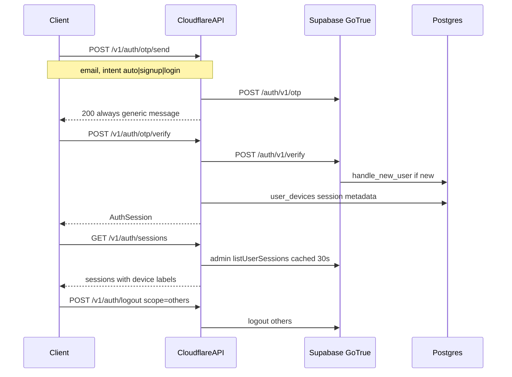

# Auth — Passwordless OTP & OAuth

İstemci Supabase URL veya anon key bilmez. Tüm oturum işlemleri Cloudflare Worker üzerinden GoTrue REST API'ye proxy edilir.

Kaynak öneriler: [`advices.md`](../advices.md) §8 (enumeration-safe OTP, PKCE cookie, GoTrue session source of truth).

## Akış



## Endpoint'ler

| Method | Path | Açıklama |
|--------|------|----------|
| POST | `/v1/auth/otp/send` | E-posta OTP gönder (**her zaman 200**) |
| POST | `/v1/auth/otp/verify` | Kod doğrula → `AuthSession` |
| POST | `/v1/auth/refresh` | Refresh token (body veya HttpOnly cookie) |
| POST | `/v1/auth/logout` | `scope`: `local` \| `others` \| `global` |
| GET | `/v1/auth/me` | GoTrue kullanıcı kimliği |
| GET | `/v1/auth/sessions` | Aktif oturumlar (KV cache 30s) |
| DELETE | `/v1/auth/sessions/{sessionId}` | Tek oturumu sonlandır |
| GET | `/v1/auth/oauth/{provider}` | Google/Apple OAuth başlat |
| GET | `/v1/auth/callback` | OAuth callback (PKCE cookie) |
| PATCH | `/v1/auth/email` | GoTrue built-in e-posta değişikliği |

**Kaldırıldı:** `/auth/login`, `/auth/signup`, şifre sıfırlama, `revoke-others` endpoint.

## OTP send — enumeration-safe

```json
// Request
{ "email": "user@example.com", "intent": "auto" }

// Response — kayıtlı olup olmadığı sızdırılmaz
{ "ok": true, "message": "If this email is eligible, a verification code was sent." }
```

`user_not_found` yalnızca **verify** aşamasında (`intent: login`).

## OTP verify

```json
{
  "email": "user@example.com",
  "code": "123456",
  "deviceName": "iPhone 15",
  "platform": "ios",
  "intent": "auto"
}
```

## Logout scope

| Scope | Davranış |
|-------|----------|
| `local` | Mevcut cihaz (varsayılan) |
| `others` | Diğer tüm oturumlar |
| `global` | Tüm oturumlar |

## Web refresh cookie

Web istemcileri `X-Use-Refresh-Cookie: true` header'ı ile verify/refresh çağırabilir. Refresh token `HttpOnly` cookie olarak set edilir; JSON yanıtta boş string döner.

## OAuth PKCE

`/v1/auth/oauth/{provider}` PKCE verifier'ı signed HttpOnly cookie'de saklar (10 dk). Callback aynı cookie'den okur — Workers isolate'ler arası güvenilir.

## Hesap silme (GDPR)

`POST /v1/account/delete` çağrılmadan önce Worker otomatik `logout scope=global` uygular, ardından `delete-account` edge function proxy edilir. Bkz. [`advices.md`](../advices.md) §3.2.

## Rate limiting

| Katman | Kapsam |
|--------|--------|
| GoTrue | Per-email OTP (Dashboard) |
| API | **IP only** on `/auth/otp/*` |

## Güvenlik

- Service role yalnızca Worker secret; oturum listesi admin API + 30s KV cache.
- Max 10 aktif session — LRU (`last_used_at`) eviction.
- Refresh token rotation GoTrue'da açık olmalı — bkz. [`auth-setup.md`](./auth-setup.md).
