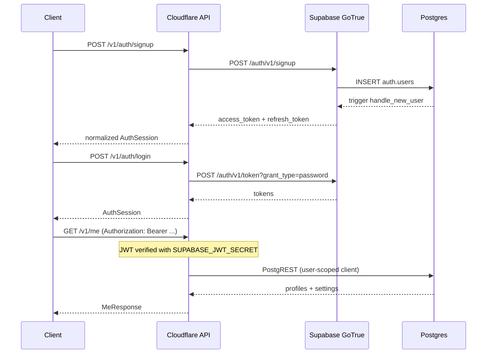

# Auth — Tam API Proxy

İstemci Supabase URL veya anon key bilmez. Tüm oturum işlemleri Cloudflare Worker üzerinden GoTrue REST API'ye proxy edilir.

## Akış



## Endpoint'ler

| Method | Path | GoTrue karşılığı |
|--------|------|------------------|
| POST | `/v1/auth/signup` | `POST /auth/v1/signup` |
| POST | `/v1/auth/login` | `POST /auth/v1/token?grant_type=password` |
| POST | `/v1/auth/refresh` | `POST /auth/v1/token?grant_type=refresh_token` |
| POST | `/v1/auth/logout` | `POST /auth/v1/logout` |

## Yanıt normalizasyonu

GoTrue snake_case yanıtı API'de camelCase `AuthSession` olarak döner:

```json
{
  "accessToken": "eyJ...",
  "refreshToken": "...",
  "expiresIn": 3600,
  "tokenType": "bearer",
  "user": { "id": "uuid", "email": "user@example.com" }
}
```

## JWT kullanımı

Korumalı route'larda:

```
Authorization: Bearer <accessToken>
```

Worker `jose` ile `SUPABASE_JWT_SECRET` kullanarak doğrular; `sub` claim `userId` olarak context'e yazılır. Edge function proxy ve PostgREST okuma route'ları aynı token'ı iletir — RLS `auth.uid()` davranışı korunur.

## Rate limiting

Auth endpoint'leri agresif limit alır:

| Route | Limit |
|-------|-------|
| `/v1/auth/login` | 10 / dakika |
| `/v1/auth/signup` | 5 / dakika |
| `/v1/auth/refresh` | 30 / dakika |

## Güvenlik notları

- Service role yalnızca Worker secret olarak saklanır; istemciye asla gönderilmez.
- Refresh token v1'de JSON body ile taşınır; web Faz 3'te HTTP-only cookie stratejisi değerlendirilebilir.
- Logout için geçerli access token gerekir (protected route).
