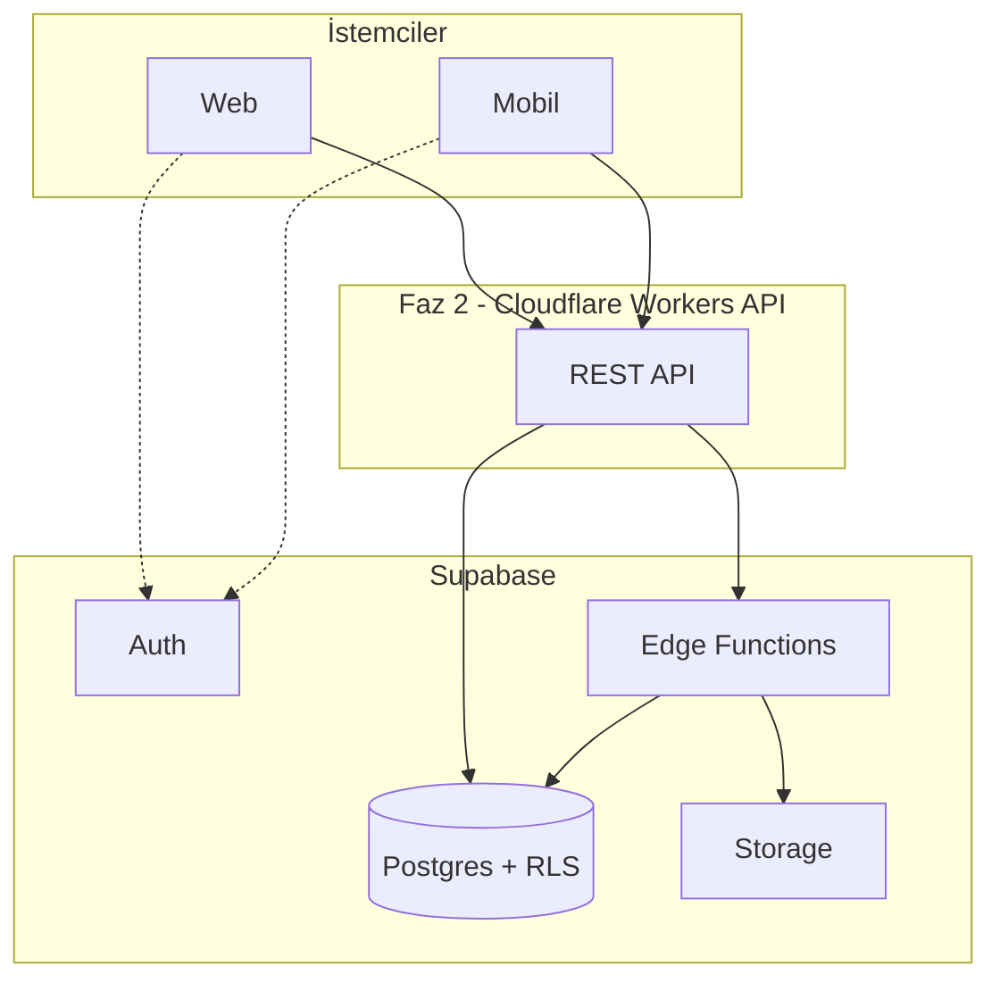

# Mimari ve Kimlik Modeli

## Hesap türleri

Platformda **üç sosyal kimlik türü** `profiles` tablosunda temsil edilir; **gruplar** ayrı entity'dir. **Platform staff** ayrı bir `account_kind` değildir — operasyonel yetki `platform_staff` tablosunda, sosyal kimlik `profiles` tablosunda tutulur; ikisi aynı `auth.users` kaydında birlikte olabilir.

| Tür | URL örneği | Duvar | Post yeri | Takip edilebilir |
|-----|------------|-------|-----------|------------------|
| **User** | `user/alice` | Yok | Sadece gruplar | Hayır |
| **Professional** | `user/dr-smith` | Var | Duvar + gruplar + sayfa bağlamı | Evet |
| **Page** | `mm/hospital-x` | Var (Facebook sayfası gibi) | Kendi duvarı | Evet |
| **Group** | `g/cardiology` | — | Grup feed'i | Hayır (üyelik) |

### Platform staff (`platform_staff`)

Moderasyon, destek ve içerik operasyonları için **operasyonel yetki** tablosu. `account_kind` enum'unda yoktur; ayrı bir sosyal profil türü veya duvar modeli tanımlamaz.

**Personel aynı zamanda normal kullanıcı olabilir.** Kayıt olan herkes `handle_new_user` ile otomatik `profiles` satırı alır; admin sonradan aynı `user_id` için `platform_staff` ekler. Böylece moderatör hem gruplarda/mesajlaşmada sosyal kimliğini kullanır, hem staff edge function'larına erişir.

```
auth.users (tek hesap)
  ├── profiles          → user / professional / page (sosyal kimlik)
  └── platform_staff    → moderator, support, … (operasyonel yetki, isteğe bağlı)
```

- Moderasyon audit'i `moderation_actions.moderator_user_id` üzerinden **auth user** ile tutulur; staff'ın ayrı bir “moderatör profili” yoktur.
- `platform_staff` kaydı yalnızca service role veya staff edge function'ları ile yönetilir (client INSERT/UPDATE yok).
- Detay: [tables/platform_staff.md](./tables/platform_staff.md)

### User (`profiles.account_kind = 'user'`)

Kayıt olan herkes otomatik user profili alır (`handle_new_user` trigger). **Kişisel duvar yoktur** — yalnızca üye olduğu gruplara post atabilir.

### Professional (`profiles.account_kind = 'professional'`)

User hesabının admin onaylı yükseltmesidir (`professional_applications`). Duvarı vardır, takip edilebilir. **Her postta en az bir kanıt (evidence) zorunludur.**

### Page (`profiles.account_kind = 'page'`)

Kurum/marka sayfası. `pages` tablosu ile 1:1 bağlıdır. `page_members` üzerinden owner/admin/editor rolleri yönetilir. Postlarda evidence zorunludur.

### Group (`groups` — profiles'tan bağımsız)

Reddit `r/` mantığı. Takip yok, **üyelik** var. User hesapları post atabilir; professional/page hesapları da gruplara katılabilir.

## Post yerleşimi (placement)

Her post şu alanlarla nereye ait olduğunu belirtir:

```
author_profile_id  → Kim adına yazılıyor (profil)
actor_user_id      → Hangi auth kullanıcısı tetikledi
group_id           → Grup postu (user için zorunlu)
page_context_id    → Başka bir sayfanın duvarında yayın (pro hesaplar için)
```

Kurallar (`validate_post_placement` trigger):

- **User** → `group_id` dolu olmalı; duvara post atamaz
- **Group post** → yazar aktif grup üyesi olmalı
- **Page context** → page hesabı başka sayfa duvarına post atamaz
- `group_id` ve `page_context_id` aynı anda dolu olamaz
- `can_post_as(author, actor)` geçmeli (sayfa postları için page_members rolü gerekir)

## İçerik gövdesi

- **Lexical JSON** → `posts.content` / `comments.content`
- **Düz metin arama özeti** → `content_plain` (max 2000 karakter)
- Medya → `media` + `post_media` (max 4 slot, max 1 video)
- Ekler → `post-attachments` bucket (max 3 dosya)

## Bildirim akışı

```
Olay (like, comment, follow, message, …)
  → emit-notification (service role)
    → notifications kaydı
    → notification_deliveries outbox
      → communication-dispatch → kanal plugin'leri
        → realtime | push (FCM) | email (Resend) | sms (Twilio) | telegram
```

Detay: [edge-functions/communication-dispatch.md](./edge-functions/communication-dispatch.md)

## Feed (v2 — Supabase katmanı hazır)

- **Uzmanlık kataloğu** (`specialties`) + post/user/group junction tablolar
- **content_type** enum — academic pool filtresi için
- **MedicalQualityScore** (`quality_score`) — `post_evidences` tabanlı
- **feed_impressions** — implicit ilgi olayları
- Ana sayfa **5-pool mixer** API katmanında (Faz B+) — [feed-ranking.md](./feed-ranking.md)

Detay: [feed-ranking.md](./feed-ranking.md)

## Katman diyagramı



Faz 1'de istemciler doğrudan Supabase Auth + Edge Functions kullanabilir; Faz 2'de API katmanı araya girer.
